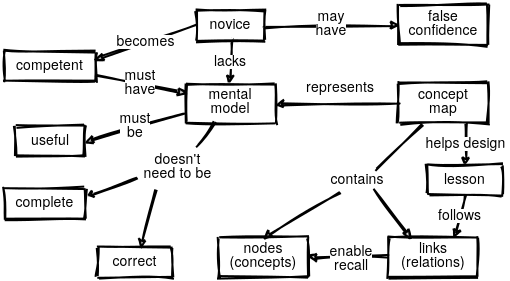
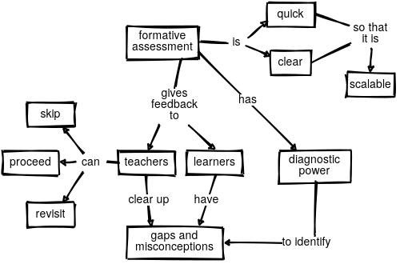

# teaching-tech-summary

This is a summary of [Teaching Tech Together](http://teachtogether.tech/en/index.html) book by [Greg Wilson](https://third-bit.com/).

___

## Table of contents

* The Rules
* Introduction
* Mental Models and Formative Assessment
* Expertise and Memory
* Cognitive Architecture
* Individual Learning
* A Lesson Design Process
* Pedagogical Content Knowledge
* Teaching as a Performance Art
* In the Classroom
* Motivation and Demotivation
* Teaching Online
* Exercise Types
* Building a Community of Practice
* Outreach
* Why I Teach
* License
* Code of Conduct
* Our Standards
* Our Responsibilities
* Scope
* Enforcement
* Attribution
* Joining Our Community
* Glossary
* Meetings, Meetings, Meetings
* Checklists and Templates
* Example Concept Maps
* Chunking Exercise Solution
* References

___

## [The Rules](http://teachtogether.tech/en/index.html#the-rules)

> 1. Be kind: all else is details.
> 2. Remember that you are not your learners…
> 3. …that most people would rather fail than change…
> 4. …and that ninety percent of magic consists of knowing one extra thing.
> 5. Never teach alone.
> 6. Never hesitate to sacrifice truth for clarity.
> 7. Make every mistake a lesson.
> 8. Remember that no lesson survives first contact with learners…
> 9. …that every lesson is too short for the teacher and too long for the learner…
> 10. …and that nobody will be more excited about the lesson than you are.

___

## [Introduction](http://teachtogether.tech/en/index.html#s:intro)

This chapter defines book's target group - [end-user teachers](http://teachtogether.tech/en/index.html#s:intro-audience) - people with variety of technical backgrounds who aren't working primarily as teachers and have little or no background in pedagogy.

It also contains other [sources](http://teachtogether.tech/en/index.html#s:intro-instead) to read, [acknowledgments](http://teachtogether.tech/en/index.html#s:intro-acknowledgments) and introduces [exercises](http://teachtogether.tech/en/index.html#s:intro-exercises) added at the end of each chapter.

___

## [Mental Models and Formative Assessment](http://teachtogether.tech/en/index.html#s:models)

This chapter introduces progression of cognitive development and simplifies it to three stages:

>* [Novices](http://teachtogether.tech/en/index.html#g:novice) - don’t know what they don’t know, i.e. they don’t yet have a usable mental model of the problem domain.
>* [Competent practitioners](http://teachtogether.tech/en/index.html#g:competent-practitioner) - have a mental model that’s adequate for everyday purposes. They can do normal tasks with normal effort under normal circumstances, and have some understanding of the limits to their knowledge (i.e. they know what they don’t know).
>* [Experts](http://teachtogether.tech/en/index.html#g:expert) - have mental models that include exceptions and special cases, which allows them to handle situations that are out of the ordinary.

It also describes [mental model](http://teachtogether.tech/en/index.html#g:mental-model):

> As the name suggests, it is a simplified representation of the most important parts of some problem domain that is good enough to enable problem solving. One example is the ball-and-spring models of molecules used in high school chemistry. Atoms aren’t actually balls, and their bonds aren’t actually springs, but the model enables people to reason about chemical compounds and their reactions. A more sophisticated model of an atom has a small central ball (the nucleus) surrounded by orbiting electrons. It’s also wrong, but the extra complexity enables people to explain more and to solve more problems. (Like software, mental models are never finished: they’re just used.)

Now, teaching novices and competent practitioners is different:

* novices need to be taught mental model, so they can put facts somewhere
* competent practitioners already have mental model, so they need to fill in the gaps in their knowledge

For example a [tutorial](http://teachtogether.tech/en/index.html#g:tutorial) is better for novices, since it helps with building mental model. On the other hand, [manuals](http://teachtogether.tech/en/index.html#g:manual) deliver facts for competent practitioners.

Notice that competent practitioners don't like tutorials because it's too slow for them. Same goes for manuals - novices won't read them because they are too complex. This phenomenon is called [expertise reversal effect](http://teachtogether.tech/en/index.html#g:expertise-reversal).

Therefore it's important to determine for which group your lessons will be made.

### [Are people learning?](http://teachtogether.tech/en/index.html#s:models-formative-assessment)

It is pointed out that students learn the fastest when their misconceptions are being identified and cleared when delivering lessons. These misconceptions fall into three categories:

>* Factual errors - like believing that Vancouver is the capital of British Columbia (it’s Victoria). These are usually simple to correct.
>* Broken models - like believing that motion and acceleration must be in the same direction. We can address these by having novices reason through examples where their models give the wrong answer.
>* Fundamental beliefs - such as “the world is only a few thousand years old”. These errors are often deeply connected to the learner’s social identity, so they resist evidence and rationalize contradictions.

This is where [formative assessment](http://teachtogether.tech/en/index.html#g:formative-assessment) comes into play. It takes place during a lesson and it gives feedback for both teacher and learner. It shouldn't break the flow of lesson while having unambiguous correct answer.

One kind of formative assessment is multiple choice question (MCQ). For example when teaching multi-digit addition:

>What is 37 + 15?
>
>a) 52
>
>b) 42
>
>c) 412
>
>d) 43

Obviously the answer is 52, but you can see that wrong answers are not accidental and each of them shows different kind of mistake when learner chooses it.

>Each of these incorrect answers is a [plausible distractor](http://teachtogether.tech/en/index.html#g:plausible-distractor) with [diagnostic power](http://teachtogether.tech/en/index.html#g:diagnostic-power). A distractor is a wrong or less-than-best answer; “plausible” means that it looks like it could be right, while “diagnostic power” means that each of the distractors helps the teacher figure out what to explain next to that particular learner.

Answers from assessments give an indication of whether the teacher should move on or stop and explain some topics again (note it is more effective to re-explain topic in different way than before).

Designing formative assessments also helps teacher with preparing lessons, covering most most likely gaps or errors. You can also use them before lesson starts - if all learners answer correctly, you can skip explaining things they already know. It is kind of [active teaching](http://teachtogether.tech/en/index.html#g:active-teaching).

### [Notional Machines](http://teachtogether.tech/en/index.html#s:models-notional)

Notional machines are things you want to teach your learners.

>A notional machine:
>
>* is an idealized abstraction of computer hardware and other aspects of programs’ runtime environments;
>* enables the semantics of programs to be described; and
>* correctly reflects what programs do when executed.

Author also provides an [example](http://teachtogether.tech/en/index.html#s:models-notional), if you need one.

### [Exercises](http://teachtogether.tech/en/index.html#s:models-exercises)

### [Review](http://teachtogether.tech/en/index.html#review)

Concepts: Mental models

Concepts: Assessment

