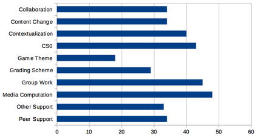
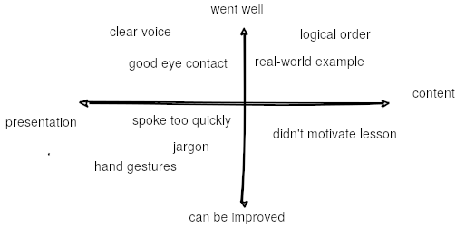

# teaching-tech-summary

This is a summary of [Teaching Tech Together](http://teachtogether.tech/en/index.html) book by [Greg Wilson](https://third-bit.com/).

___

## Table of contents

* [The Rules](#the-rules)
* [Introduction](#introduction)
* [Mental Models and Formative Assessment](#mental-models-and-formative-assessment)
* [Expertise and Memory](#expertise-and-memory)
* [Cognitive Architecture](#cognitive-architecture)
* [Individual Learning](#individual-learning)
* [A Lesson Design Process](#a-lesson-design-process)
* [Pedagogical Content Knowledge](#pedagogical-content-knowledge)
* [Teaching as a Performance Art](#teaching-as-a-performance-art)
* [In the Classroom](#in-the-classroom)
* [Motivation and Demotivation](#motivation-and-demotivation)
* [Teaching Online](#teaching-online)
* [Exercise Types](#exercise-types)
* [Building a Community of Practice](#building-a-community-of-practice)
* [Outreach](#outreach)
* [Why I Teach](#why-i-teach)
* [License](#license)
* [Code of Conduct](#code-of-conduct)
* [Our Standards](#out-standards)
* [Our Responsibilities](#our-responsibilities)
* [Scope](#scope)
* [Enforcement](#enforcement)
* [Attribution](#attribution)
* [Joining Our Community](#joining-our-community)
* [Glossary](#glossary)
* [Meetings, Meetings, Meetings](#meetings,-meetings,-meetings)
* [Checklists and Templates](#checklists-and-templates)
* [Example Concept Maps](#example-concept-maps)
* [Chunking Exercise Solution](#chunking-exercise-solution)
* [References](#references)

___

## [The Rules](http://teachtogether.tech/en/index.html#the-rules)

> 1. Be kind: all else is details.
> 2. Remember that you are not your learners…
> 3. …that most people would rather fail than change…
> 4. …and that ninety percent of magic consists of knowing one extra thing.
> 5. Never teach alone.
> 6. Never hesitate to sacrifice truth for clarity.
> 7. Make every mistake a lesson.
> 8. Remember that no lesson survives first contact with learners…
> 9. …that every lesson is too short for the teacher and too long for the learner…
> 10. …and that nobody will be more excited about the lesson than you are.

___

## [Introduction](http://teachtogether.tech/en/index.html#s:intro)

This chapter defines book's target group - [end-user teachers](http://teachtogether.tech/en/index.html#s:intro-audience) - people with variety of technical backgrounds who aren't working primarily as teachers and have little or no background in pedagogy.

It also contains other [sources](http://teachtogether.tech/en/index.html#s:intro-instead) to read, [acknowledgments](http://teachtogether.tech/en/index.html#s:intro-acknowledgments) and introduces [exercises](http://teachtogether.tech/en/index.html#s:intro-exercises) added at the end of each chapter.

___

## [Mental Models and Formative Assessment](http://teachtogether.tech/en/index.html#s:models)

This chapter introduces progression of cognitive development and simplifies it to three stages:

>* [Novices](http://teachtogether.tech/en/index.html#g:novice) - don’t know what they don’t know, i.e. they don’t yet have a usable mental model of the problem domain.
>* [Competent practitioners](http://teachtogether.tech/en/index.html#g:competent-practitioner) - have a mental model that’s adequate for everyday purposes. They can do normal tasks with normal effort under normal circumstances, and have some understanding of the limits to their knowledge (i.e. they know what they don’t know).
>* [Experts](http://teachtogether.tech/en/index.html#g:expert) - have mental models that include exceptions and special cases, which allows them to handle situations that are out of the ordinary.

It also describes [mental model](http://teachtogether.tech/en/index.html#g:mental-model):

> As the name suggests, it is a simplified representation of the most important parts of some problem domain that is good enough to enable problem solving. One example is the ball-and-spring models of molecules used in high school chemistry. Atoms aren’t actually balls, and their bonds aren’t actually springs, but the model enables people to reason about chemical compounds and their reactions. A more sophisticated model of an atom has a small central ball (the nucleus) surrounded by orbiting electrons. It’s also wrong, but the extra complexity enables people to explain more and to solve more problems.

Now, teaching novices and competent practitioners is different:

* novices need to be taught mental model, so they can put facts somewhere
* competent practitioners already have mental model, so they need to fill in the gaps in their knowledge

For example a [tutorial](http://teachtogether.tech/en/index.html#g:tutorial) is better for novices, since it helps with building mental model. On the other hand, [manuals](http://teachtogether.tech/en/index.html#g:manual) deliver facts for competent practitioners.

Notice that competent practitioners don't like tutorials because it's too slow for them. Same goes for manuals - novices won't read them because they are too complex. This phenomenon is called [expertise reversal effect](http://teachtogether.tech/en/index.html#g:expertise-reversal).

Therefore it's important to determine for which group your lessons will be made.

### [Are people learning?](http://teachtogether.tech/en/index.html#s:models-formative-assessment)

It is pointed out that students learn the fastest when their misconceptions are being identified and cleared when delivering lessons. These misconceptions fall into three categories:

>* Factual errors - like believing that Vancouver is the capital of British Columbia (it’s Victoria). These are usually simple to correct.
>* Broken models - like believing that motion and acceleration must be in the same direction. We can address these by having novices reason through examples where their models give the wrong answer.
>* Fundamental beliefs - such as “the world is only a few thousand years old”. These errors are often deeply connected to the learner’s social identity, so they resist evidence and rationalize contradictions.

This is where [formative assessment](http://teachtogether.tech/en/index.html#g:formative-assessment) comes into play. It takes place during a lesson and it gives feedback for both teacher and learner. It shouldn't break the flow of lesson while having unambiguous correct answer.

One kind of formative assessment is multiple choice question (MCQ). For example when teaching multi-digit addition:

>What is 37 + 15?
>
>a) 52
>
>b) 42
>
>c) 412
>
>d) 43

Obviously the answer is 52, but you can see that wrong answers are not accidental and each of them shows different kind of mistake when learner chooses it.

>Each of these incorrect answers is a [plausible distractor](http://teachtogether.tech/en/index.html#g:plausible-distractor) with [diagnostic power](http://teachtogether.tech/en/index.html#g:diagnostic-power). A distractor is a wrong or less-than-best answer; “plausible” means that it looks like it could be right, while “diagnostic power” means that each of the distractors helps the teacher figure out what to explain next to that particular learner.

Answers from assessments give an indication of whether the teacher should move on or stop and explain some topics again (note it is more effective to re-explain topic in different way than before).

Designing formative assessments also helps teacher with preparing lessons, covering most most likely gaps or errors. You can also use them before lesson starts - if all learners answer correctly, you can skip explaining things they already know. It is kind of [active teaching](http://teachtogether.tech/en/index.html#g:active-teaching).

### [Notional Machines](http://teachtogether.tech/en/index.html#s:models-notional)

Notional machines are things you want to teach your learners.

>A notional machine:
>
>* is an idealized abstraction of computer hardware and other aspects of programs’ runtime environments;
>* enables the semantics of programs to be described; and
>* correctly reflects what programs do when executed.

Author also provides an [example](http://teachtogether.tech/en/index.html#s:models-notional), if you need one.

### [Exercises](http://teachtogether.tech/en/index.html#s:models-exercises)

### [Review](http://teachtogether.tech/en/index.html#review)

Concepts: Mental models


Concepts: Assessment


___

## [Expertise and memory](http://teachtogether.tech/en/index.html#s:memory)

This chapter starts from describing who expert is. It gives us this metaphor:

>Imagine for a moment that we store knowledge as a network or graph in which facts are nodes and relationships are arcs. The key difference between experts and competent practitioners is that experts’ mental models are much more densely connected, i.e. they are more likely to know a connection between any two facts.

We can observe specific behavior for experts:

* Experts can often jump directly from a problem to a solution because there actually is a direct link between the two in their mind ([intuition](http://teachtogether.tech/en/index.html#g:intuition)).
* Densely-connected graphs are also the basis for experts’ [fluid representations](http://teachtogether.tech/en/index.html#g:fluid-representation), i.e. their ability to switch back and forth between different views of a problem.
* More linkages between facts makes it easier to reason backward from symptoms to causes.
* Finally, experts are often so familiar with their subject that they can no longer imagine what it’s like to not see the world that way.

The last of these points is called [expert blind spot](http://teachtogether.tech/en/index.html#g:expert-blind-spot).

### [Concept Maps](http://teachtogether.tech/en/index.html#s:memory-concept-maps)

>Our tool of choice for representing someone’s mental model is a [concept map](http://teachtogether.tech/en/index.html#g:concept-map), in which facts are bubbles and connections are labeled connections.

You could see example in previous chapter [review](#review).

>Concept maps can be used in many ways:
>
>* Helping teachers figure out what they’re trying to teach.
>* Aiding communication between lesson designers.
>* Aiding communication with learners.
>* For assessment.

There are other ways to represent mental models e.g. Venn diagrams, flowcharts and decision trees. All of these [externalize cognition](http://teachtogether.tech/en/index.html#g:externalized-cognition).

### [Seven Plus or Minus Two](http://teachtogether.tech/en/index.html#s:memory-seven-plus-or-minus)

Human memory can be divided into two layers:

* [long-term](http://teachtogether.tech/en/index.html#g:long-term-memory) (persistent) memory - its capacity is essentially unlimited, but it is slow to access
* [short-term](http://teachtogether.tech/en/index.html#g:short-term-memory) (working) memory - faster, but smaller

In [1956, Miller, George A.](http://teachtogether.tech/en/index.html#ref-Mill1956) estimated that the average adult's working memory could only hold 7±2 items at a time. 7±2 number is very important because an information to be stored in long-term memory must be first held and rehearsed in short-term memory.

This is why you shouldn't overload learners with information. Also, this is where concept map comes in handy: teacher can pick subsection from it (which fills working memory) and lead to a formative assessment.


Using concept maps in lesson design

### [Becoming an Expert](http://teachtogether.tech/en/index.html#s:memory-becoming-expert)

To become an expert it is important to pay attention to what we do and getting feedback from our work so then in response to it we can change our behavior to get cumulatively better. It's called [deliberate](http://teachtogether.tech/en/index.html#g:deliberate-practice) or reflective practice and there are three stages of it:

* Act on feedback from others.
* Give feedback on other's work.
* Give feedback to ourselves.

### [Exercises](http://teachtogether.tech/en/index.html#s:memory-exercises)

___

## [Cognitive Architecture](http://teachtogether.tech/en/index.html#s:architecture)

This chapter digs a bit into what brains do when learning and how we can use it to our advantages.

### [What’s Going On In There?](http://teachtogether.tech/en/index.html#s:architecture-brain)


The figure above is a simplified model of human cognitive architecture. It separates short-term and long-term memories and shows that our brain can move information between them.

>Information gets into short-term memory primarily through your verbal channel (for speech) and visual channel (for images). Most people rely primarily on their visual channel, but when images and words complement each other, the brain does a better job of remembering them both: they are encoded together, so recall of one later on helps trigger recall of the other.

Therefore it is better to present information in both channels. Be wary though, as the information from channels should be complementing each other, otherwise it becomes redundant and [split-attention effect](http://teachtogether.tech/en/index.html#g:split-attention-effect) takes place. For example when watching video with both voiceover and subtitles, our brain has to put some effort into checking if both of them agree with each other.

### [Cognitive Load](http://teachtogether.tech/en/index.html#s:architecture-load)

It is more effective to teach by showing how to do things step by step than giving learners option to use their own initiative to solve problems (known as [inquiry-based learning](http://teachtogether.tech/en/index.html#g:inquiry-based-learning)).

[Cognitive load theory](http://teachtogether.tech/en/index.html#g:cognitive-load) tells us that when learning people have to deal with three things:

* [Intrinsic load](http://teachtogether.tech/en/index.html#g:intrinsic-load) is what people have to keep in mind in order to absorb new material.
* [Germane Load](http://teachtogether.tech/en/index.html#g:germane-load) is the (desirable) mental effort required to link new information to old, which is one of the things that distinguishes learning from memorization.
* [Extraneous Load](http://teachtogether.tech/en/index.html#g:extraneous-load) is anything that distracts from learning.

>Cognitive load theory holds that people have to divide a fixed amount of working memory between these three things. Our goal as teachers is to maximize the memory available to handle intrinsic load, which means reducing the germane load at each step and eliminating the extraneous load.

[Parsons problem](http://teachtogether.tech/en/index.html#g:parsons-problem) is an assessment technique which does that. When programming, instead of writing entire program from scratch, give learners lines of code which are enough to solve to problem, but need to be put in order. This makes them focus on control flow and data dependencies without being distracted by variable naming, etc.

>Another type of exercise that can be explained in terms of cognitive load is to give learners a series of [faded examples](http://teachtogether.tech/en/index.html#g:faded-example). The first example in a series presents a complete use of a particular problem-solving strategy. The next problem is of the same type, but has some gaps for the learner to fill in. Each successive problem gives the learner less [scaffolding](http://teachtogether.tech/en/index.html#g:scaffolding), until they are asked to solve a complete problem from scratch.

For example starting from complete solution in python:

```python
# total_length(["red", "green", "blue"]) => 12
define total_length(list_of_words):
    total = 0
    for word in list_of_words:
        total = total + length(word)
    return total
```

then:

```python
# word_lengths(["red", "green", "blue"]) => [3, 5, 4]
define word_lengths(list_of_words):
    list_of_lengths = []
    for ____ in ____:
        append(list_of_lengths, ____)
    return list_of_lengths
```

and:

```python
# join_all(["red", "green", "blue"]) => "redgreenblue"
define join_all(list_of_words):
    joined_words = ____
    for ____ in ____:
        ____
    return joined_words
```

finally:

```python
# make_acronym(["red", "green", "blue"]) => "RGB"
define make_acronym(list_of_words):
    ____
```

Faded examples work because they introduce the problem-solving strategy piece by piece: at each step, learners have one new problem to tackle. When constructing them it's important to think about the problem-solving strategy it is meant to teach.

[Labeling subgoals](http://teachtogether.tech/en/index.html#g:subgoal-labeling) means giving names to the steps in a step-by-step description of a problem-solving process. From previous python example we can name subgoals as follows:

1. Create an empty value of the type to be returned.
2. Get the value to be added to the result from the loop variable.
3. Update the result with that value.

>Labeling subgoals works because grouping related steps into named chunks helps learners distinguish what’s generic from what is specific to the problem at hand. It also helps them build a mental model of that kind of problem so that they can solve other problems of that kind, and gives them a natural opportunity for self-explanation.

### [Other Models of Learning](http://teachtogether.tech/en/index.html#s:architecture-theory)

>Two specific perspectives from [educational psychology](http://teachtogether.tech/en/index.html#g:educational-psychology) have influenced this book. The one we have used so far is [cognitivism](http://teachtogether.tech/en/index.html#g:cognitivism), which focuses on things like pattern recognition, memory formation, and recall. It is good at answering low-level questions, but generally ignores larger issues like, “What do we mean by ‘learning’?” and, “Who gets to decide?” The other is [situated learning](http://teachtogether.tech/en/index.html#g:situated-learning), which focuses on bringing people into a community and recognizes that teaching and learning are always rooted in who we are and who we aspire to be.

Besides cognitivism we have other perspectives like:

* [behaviorism](http://teachtogether.tech/en/index.html#g:behaviorism), which treats education as stimulus/response conditioning
* [constructivism](http://teachtogether.tech/en/index.html#g:constructivism), which considers learning an active process during which learners construct knowledge for themselves
* [connectivism](http://teachtogether.tech/en/index.html#g:connectivism), which holds that knowledge is distributed, that learning is the process of navigating, growing, and pruning connections, and which emphasizes the social aspects of learning made possible by the internet

### [Exercises](http://teachtogether.tech/en/index.html#s:architecture-exercises)

### [Review](http://teachtogether.tech/en/index.html#review-1)


## [Individual Learning](http://teachtogether.tech/en/index.html#s:individual)

This chapter focuses on learners instead of teachers - what they can do for themselves.

The most effective strategy is to switch from [passive learning](http://teachtogether.tech/en/index.html#g:passive-learning) to [active learning](http://teachtogether.tech/en/index.html#g:active-learning).

Passive | Active
:-------|:--------
Read about something | Do exercises
Watch a video | Discuss a topic
Attend a lecture | Try to explain it

Active learning keeps new information in short-term memory longer as well as strengthen ties between that information and what they already know.

Other thing is [metacognition](http://teachtogether.tech/en/index.html#g:metacognition) (thinking about one's own thinking), which means making plans, setting goals and monitoring their progress.

>The big prize is [transfer of learning](http://teachtogether.tech/en/index.html#g:transfer-of-learning), which occurs when one thing we have learned helps us learn other things more quickly. Researchers distinguish between [near transfer](http://teachtogether.tech/en/index.html#g:near-transfer), which occurs between similar or related areas like fractions and decimals in mathematics, and [far transfer](http://teachtogether.tech/en/index.html#g:far-transfer), which occurs between dissimilar domains—for example, the idea that learning to play chess will help mathematical reasoning or vice versa (though in practice it rarely occures).

### [Six Strategies](http://teachtogether.tech/en/index.html#s:individual-strategies)

The [Learning Scientists](https://www.learningscientists.org/) have catalogued six of these strategies and summarized them in a set of [downloadable posters](https://www.learningscientists.org/downloadable-materials).

#### Spaced Practice

The basic idea is to spread studying activity over time: block off at least half an hour to study each topic each day rather than trying to cram everything in the night before an exam.

Also review material after each class (while mixing up some older material), and note things that you have forgotten from it.

#### Retrieval Practice

>The limiting factor for long-term memory is not retention (what is stored) but recall (what can be accessed). Recall of specific information improves with practice, so outcomes in real situations can be improved by taking practice tests or summarizing the details of a topic from memory and then checking what was and wasn’t remembered.

Recall is better when practice uses activities similar to those used in testing. This phenomenon is called [transfer-appropriate processing](http://teachtogether.tech/en/index.html#g:transfer-appropriate-processing).

To improve retrieval skills you can:

* solve problems twice - first time entirely from memory, then with resources
* make flash cards - it is a card that has question on one side and answer on the other
* use [read-cover-retrieve](http://teachtogether.tech/en/index.html#g:read-cover-retrieve) method - when reading something, cover some definitions or terms with sticky notes, then try to guess it before uncovering

#### Interleaving

This method consists of shuffling study sessions instead of mastering subjects one by one. For example learning topics in order A-B-C-B-A-C is better than A-B-C-A-B-C which is also better than A-A-B-B-C-C.

#### Elaboration

The idea is to explain things to yourself which helps you understand and remember them.

One way to do this is to follow up each answer on a practice quiz with an explanation of why that answer is correct, or conversely with an explanation of why some other plausible answer isn’t.

#### Concrete Examples

You can use concrete examples i.e. whenever you have a statement of a general principle, try to provide one or more examples of its use, or conversely take each particular problem and list the general principles it embodies.

>One structured way to do this is the [ADEPT](https://betterexplained.com/articles/adept-method/) method: give an **A**nalogy, draw a **D**iagram, present an **E**xample, describe the idea in **P**lain language, and then give the **T**echnical details.

You can also teach by contrast i.e. to show learners what a solution is not or what kind of problem a technique won’t solve.

#### Dual Coding

The last strategy is to present words and images together. If complementary information is presented through both verbal and visual channels, they can reinforce each other.

>One way to take advantage of dual coding is to draw or label timelines, maps, family trees, or whatever else seems appropriate to the material.

### Time Management

Some facts:

1. Working more than 8 hours a day for an extended period of time lowers your total productivity, not just your hourly productivity — i.e. you get less done in total (not just per hour) when you’re in crunch mode.
2. Working over 21 hours in a stretch increases the odds of you making a catastrophic error just as much as being legally drunk.
3. Productivity varies over the course of the workday, with the greatest productivity occurring in the first 4 to 6 hours. After enough hours, productivity approaches zero; eventually it becomes negative.

Overall, it is very ineffective to work for very long time or to pull an all-nighter. *People usually don't notice their abilities declining*. For example, ability to think drops by 25% for each 24 hours you are awake.

One widely-used technique which helps to be productive is to make a list of things that need to be done, then sort them by priority, and then switch off email and other interruptions for 30-60 minutes and complete one of those tasks (you can break down bigger tasks into smaller pieces).

>The most important part of this is switching off interruptions. Despite what many people want to believe, human beings are not good at multi-tasking. What we can become good at is [automaticity](http://teachtogether.tech/en/index.html#g:automaticity), which is the ability to do something routine in the background while doing something else.

The point of organizing and preparing is to get into the most productive mental state possible (it's called [flow](http://teachtogether.tech/en/index.html#g:flow)). It takes roughly 10 minutes to get back into this state after an interruption, no matter how short the interruption was.

### [Peer Assessment](http://teachtogether.tech/en/index.html#s:individual-peer)

One way to implement peer assessment is [contributing student pedagogy](http://teachtogether.tech/en/index.html#g:contributing-student), in which learners produce artifacts to contribute to others’ learning. This can be developing a short lesson and sharing it with the class, adding to a question bank, or writing up notes from a particular lecture for in-class publication.

Another approach is [calibrated peer review](http://teachtogether.tech/en/index.html#g:calibrated-peer-review), in which a learner reviews one or more examples using a rubric and compares their evaluation against the teacher’s review of the same work. Once learners’ evaluations are close enough to the teacher’s, they start evaluating their peers’ actual work. If several peers’ assessments are combined, this can be as accurate as assessment by teachers.

### [Exercises](http://teachtogether.tech/en/index.html#s:individual-exercises)

### [Review](http://teachtogether.tech/en/index.html#review-2)


## [A Lesson Design Process](http://teachtogether.tech/en/index.html#s:process)

[Backward design](http://teachtogether.tech/en/index.html#g:backward-design) is a method that works very well for lesson design. In simplified form, its steps are:

1. Create or recycle learner personas (discussed in the next section) to figure out who you are trying to help and what will appeal to them.
2. Brainstorm to get a rough idea of what you want to cover, how you’re going to do it, what problems or misconceptions you expect to encounter, what’s not going to be included, and so on. Drawing concept maps can help a lot at this stage.
3. Create a summative assessment to define your overall goal. This can be the final exam for a course or the capstone project for a one-day workshop; regardless of its form or size, it shows how far you hope to get more clearly than a point-form list of objectives.
4. Create formative assessments that will give people a chance to practice the things they’re learning. These will also tell you (and them) whether they’re making progress and where they need to focus their attention. The best way to do this is to itemize the knowledge and skills used in the summative assessment you developed in the previous step and then create at least one formative assessment for each.
5. Order the formative assessments to create a course outline based on their complexity, their dependencies, and how well topics will motivate your learners.
6. Write material to get learners from one formative assessment to the next. Each hour of instruction should consist of three to five such episodes.
7. Write a summary description of the course to help its intended audience find it and figure out whether it’s right for them.

This method helps keep teaching focused on its objectives. It also ensures that learners don’t face anything at the end of the course that they are not prepared for.

### [Learner Personas](http://teachtogether.tech/en/index.html#s:process-personas)

A learner persona consists of:

1. the person’s general background;
2. what they already know;
3. what they want to do; and
4. any special needs they have.

For example a learner persona for a volunteer group that runs weekend Python workshops might be:

1. Jorge just moved from Costa Rica to Canada to study agricultural engineering. He has joined the college soccer team and is looking forward to learning how to play ice hockey.
2. Other than using Excel, Word, and the internet, Jorge’s most significant previous experience with computers is helping his sister build a WordPress site for the family business back home.
3. Jorge wants to measure properties of soil from nearby farms using a handheld device that sends data to his computer. Right now he has to open each data file in Excel, delete the first and last column, and calculate some statistics on what’s left. He has to collect at least 600 measurements in the next few months, and really doesn’t want to have to do these steps by hand for each one.
4. Jorge can read English well, but sometimes struggles to keep up with spoken conversation that involves a lot of jargon.

>Personas should always describe what the learner wants to do rather than what you think they actually need. Ask yourself what they are searching for online; it probably won’t include jargon that they don’t yet know, so part of what you have to do as an instructional designer is figure out how to make your lesson findable.

### [Learning Objectives](http://teachtogether.tech/en/index.html#s:process-objectives)

>A [learning objective](http://teachtogether.tech/en/index.html#g:learning-objective) is what a lesson strives to achieve. A [learning outcome](http://teachtogether.tech/en/index.html#g:learning-outcome) is what it actually achieves, i.e. what learners actually take away. The role of summative assessment is therefore to compare learning outcomes with learning objectives.

A learning objective describes how the learner will demonstrate what they have learned once they have successfully completed a lesson. More specifically, it has a measurable or verifiable verb that states what the learner will do and specifies the criteria for acceptable performance.

One way to understand what makes for a good learning objective is to see how a poor one can be improved:

* The learner will be given opportunities to learn good programming practices.
  * This describes the lesson’s content, not the attributes of successful learners.
* The learner will have a better appreciation for good programming practices.
  * This doesn’t start with an active verb or define the level of learning, and the subject of learning has no context and is not specific.
* The learner will understand how to program in R.
  * While this starts with an active verb, it doesn’t define the level of learning and the subject of learning is still too vague for assessment.
* The learner will write one-page data analysis scripts to read, filter, and summarize tabular data using R.
  * This starts with an active verb, defines the level of learning, and provides context to ensure that outcomes can be assessed.

When it comes to choosing verbs, many teachers use [Bloom's Taxonomy](http://teachtogether.tech/en/index.html#g:blooms-taxonomy). It has six categories, each providing verbs used in learning objectives:

* **Remembering:** Exhibit memory of previously learned material by recalling facts, terms, basic concepts, and answers. (recognize, list, describe, name, find)
* **Understanding:** Demonstrate understanding of facts and ideas by organizing, comparing, translating, interpreting, giving descriptions, and stating main ideas. (interpret, summarize, paraphrase, classify, explain)
* **Applying:** Solve new problems by applying acquired knowledge, facts, techniques and rules in a different way. (build, identify, use, plan, select)
* **Analyzing:** Examine and break information into parts by identifying motives or causes; make inferences and find evidence to support generalizations. (compare, contrast, simplify)
* **Evaluating:** Present and defend opinions by making judgments about information, validity of ideas, or quality of work based on a set of criteria. (check, choose, critique, prove, rate)
* **Creating:** Compile information together in a different way by combining elements in a new pattern or proposing alternative solutions. (design, construct, improve, adapt, maximize, solve)

There is also [Fink's Taxonomy](http://teachtogether.tech/en/index.html#g:finks-taxonomy):

* **Foundational Knowledge:** understanding and remembering information and ideas. (remember, understand, identify)
* **Application:** skills, critical thinking, managing projects. (use, solve, calculate, create)
* **Integration:** connecting ideas, learning experiences, and real life. (connect, relate, compare)
* **Human Dimension:** learning about oneself and others. (come to see themselves as, understand others in terms of, decide to become)
* **Caring:** developing new feelings, interests, and values. (get excited about, be ready to, value)
* **Learning How to Learn:** becoming a better learner. (identify source of information for, frame useful questions about)

### [Maintainability](http://teachtogether.tech/en/index.html#s:process-maintainability)

A lesson is maintainable when it is cheaper to update it than to replace it. It depends on four factors:

* How well documented the course’s design is - if the person doing maintenance doesn’t know (or doesn’t remember) what the lesson is supposed to accomplish or why topics are introduced in a particular order, it will take them more time to update it.
* How easy it is for collaborators to collaborate technically.
* How willing people are to collaborate.
* How useful sharing actually is - the [Reusability Paradox](http://teachtogether.tech/en/index.html#g:reusability-paradox) states that the more reusable a learning object is, the less pedagogically effective it is. Direct re-use may therefore be the wrong goal for lessons; we might get further by trying to make them easier to remix.

### [Exercises](http://teachtogether.tech/en/index.html#s:process-exercises)

### [Review](http://teachtogether.tech/en/index.html#review-3)


## [Pedagogical Content Knowledge](http://teachtogether.tech/en/index.html#s:pck)

Every teacher needs three things:

* [**content knowledge**](http://teachtogether.tech/en/index.html#g:content-knowledge) such as how to program;
* [**general pedagogical knowledge**](http://teachtogether.tech/en/index.html#g:general-pedagogical-knowledge) such as an understanding of the psychology of learning; and
* [**pedagogical content knowledge**](http://teachtogether.tech/en/index.html#g:pedagogical-content-knowledge) (PCK), which is the domain-specific knowledge of how to teach a particular concept to a particular audience. In computing, PCK includes things like what examples to use when teaching how parameters are passed to a function or what misconceptions about nesting HTML tags are most common.

>As with all research, some caution is required when interpreting results:
>
>* Theories change as more data becomes available.
>* Most of these studies’ subjects are WEIRD:
they are from Western, Education, Industrialized, Rich, and Democratic societies
>
>If this was an academic treatise, I would therefore preface most claims with qualifiers like, “Some research may seem to indicate that…” But since actual teachers in actual classrooms have to make decisions regardless of whether research has clear answers yet or not, this chapter presents actionable best guesses rather than nuanced perhapses.

### [What Are We Teaching Them Now?](http://teachtogether.tech/en/index.html#s:pck-now)

Very little is known about what coding bootcamps and other free-range initiatives teach, in part because many are reluctant to share their curriculum. We know more about what is taught by institution:

Topic|%|Topic|%
:---|:---|:---|:---
Programming Process|87%|Data Types|23%
Abstract Programming Thinking|63%|Input/Output|17%
Data Structures|40%|Libraries|15%
Object-Oriented Concepts|36%|Variables & Assignment|14%
Control Structures|33%|Recursion|10%
Operations & Functions|26%|Pointers & Memory Management|5%

### [How Much Are They Learning](http://teachtogether.tech/en/index.html#s:pck-learning)

In short, measure and track results (of your learners) in ways that can be compared over time so that you can tell if your lessons are becoming more or less effective.

### [What Misconceptions Do Novices Have?](http://teachtogether.tech/en/index.html#s:pck-misunderstand)

The biggest misconception novices have — sometimes called the “superbug” in coding — is the belief that computers understand what people mean in the way that another human being would.

An example of a misconception is:

```python
grade = 65
total = grade + 10
grade = 80
print(total)
```

After this code, some incorrectly believe that the value of `total` will be 90 rather than 75. Other misconceptions inclue:

* A variable holds the history of the values it has been assigned, i.e. it remembers what its value used to be.
* Two objects with the same value for a `name` or `id` attribute are guaranteed to be the same object.
* Functions are executed as they are defined, or are executed in the order in which they are defined.
* A `while` loop’s condition is constantly evaluated, and the loop stops as soon as it becomes false. Conversely, the conditions in `if` statements are also constantly evaluated, and their statements are executed as soon as the condition becomes true regardless of where the flow of control is at the time.
* Assignment moves values, i.e. after `a = b`, the variable `b` is empty.

### [What Mistakes Do Novices Make?](http://teachtogether.tech/en/index.html#s:pck-mistakes)

>The mistakes novices make can tell us what to prioritize in our teaching, but it turns out that most teachers don’t know how common different kinds of mistakes actually are. The largest study of this is, [[Brow2017](http://teachtogether.tech/en/index.html#ref-Brow2017)] which found that mismatched quotes and parentheses are the most common type of errors in novice Java programs, but also the easiest to fix, while some mistakes (like putting the condition of an `if` in `{}` instead of `()`) are most often made only once. Unsurprisingly, mistakes that produce compiler errors are fixed much faster than ones that don’t. Some mistakes, however, are made many times, like invoking methods with the wrong arguments (e.g. passing a string instead of an integer).

### [How Do Novices Program?](http://teachtogether.tech/en/index.html#s:pck-programming)

Recent work has shown the effectiveness of teaching four distinct skills in a specific order:


||semantics of code|templates related to goals
:---|:---|:---
reading|1. read code and predict behavior|3. recognize templates and their uses
writing|2. write correct syntax|4. use templates to meet goals

Our next recommendations are therefore to have learners read code, then modify it, then write it, and to introduce common patterns explicitly and have learners practice using them.

### [How Do Novices Debug?](http://teachtogether.tech/en/index.html#s:pck-debug)

[[List2004](http://teachtogether.tech/en/index.html#ref-List2004),[List2009](http://teachtogether.tech/en/index.html#ref-List2009)] found that many novices struggled to predict the output of short pieces of code and to select the correct completion of the code from a set of possibilities when told what it was supposed to do.

Our fifth recommendation is therefore to explicitly teach novices how to debug. [[Fitz2008](http://teachtogether.tech/en/index.html#ref-Fitz2008),[Murp2008](http://teachtogether.tech/en/index.html#ref-Murp2008)] found that good debuggers were good programmers, but not all good programmers were good at debugging. Those who were used a symbolic debugger to step through their programs, traced execution by hand, wrote tests, and re-read the spec frequently, which are all teachable habits. However, tracing execution step by step was sometimes used ineffectively: for example, a novice might put the same `print` statement in both parts of an `if-else`. Novices would also comment out lines that were actually correct as they tried to isolate a problem; teachers can make both of these mistakes deliberately, point them out, and correct them to help novices get past them.

* Teaching novices how to debug can also help make classes easier to manage.
* Debugging depends on being able to read code, which multiple studies have shown is the single most effective way to find bugs.
* Having learners predict a program’s output just before it is run, on the other hand, helps reinforce learning and also gives them a natural moment to ask “what if” questions.

### [What About Testing?](http://teachtogether.tech/en/index.html#s:pck-testing)

[[Bria2015](http://teachtogether.tech/en/index.html#ref-Bria2015)] found that novices’ tests often have low coverage (i.e. they don’t test most of the code) and that they often test many things at once, which makes it hard to pinpoint the causes of errors.

Another study [[Edwa2014b](http://teachtogether.tech/en/index.html#ref-Edwa2014b)] found that novices’ tests only detected an average of 13.6% of the faults present in the entire program population. What’s more, 90% of the novices’ tests were very similar, which indicates that novices mostly write tests to confirm that code is doing what it’s supposed to rather than to find cases where it isn’t.

One approach to teaching better testing practices is to define a programming problem by providing a set of tests to be passed rather than through a written description. Before doing this, though, take a moment to look at how many tests you’ve written for your own code recently, and then decide whether you’re teaching what you believe people should do, or what they (and you) actually do.

### [Do Languages Matter?](http://teachtogether.tech/en/index.html#s:pck-language)

The short answer is “yes”: novices learn to program faster and learn more using blocks-based tools like Scratch [[Wein2017](http://teachtogether.tech/en/index.html#ref-Wein2017)]. One reason is that blocks-based systems reduce cognitive load by eliminating the possibility of syntax errors.

But what happens after blocks?[[Chen2018](http://teachtogether.tech/en/index.html#ref-Chen2018)] found that learners whose first programming language was graphical had higher grades in introductory programming courses than learners whose first language was textual when the languages were introduced in or before early adolescent years. Our sixth recommendation is therefore to start children and teens with blocks-based interfaces before moving to text-based systems. The age qualification is there because Scratch deliberately looks like it’s meant for younger users, and it can still be hard to convince adults to take it seriously.

#### Object-Oriented Programming

Introducing objects early has a few challenges.[[Mill2016b](http://teachtogether.tech/en/index.html#ref-Mill2016b)] found that most novices using Python struggled to understand self (which refers to the current object): they omitted it in method definitions, failed to use it when referencing object attributes, or both.[[Rago2017](http://teachtogether.tech/en/index.html#ref-Rago2017)] found something similar in high school students, and also found that high school teachers often weren’t clear on the concept either. On balance, we recommend that teachers start with functions rather than objects, i.e. that learners not be taught how to define classes until they understand basic control structures and data types.

#### Type Declarations

[[Endr2014](http://teachtogether.tech/en/index.html#ref-Endr2014),[Fisc2015](http://teachtogether.tech/en/index.html#ref-Fisc2015)] found that requiring novices to declare variable types does add some complexity to programs, but it pays off fairly quickly by acting as documentation for a method’s use — in particular, by forestalling questions about what’s available and how to use it.

#### Variable Naming

[[Bink2012](http://teachtogether.tech/en/index.html#ref-Bink2012)] reported that reading and understanding code is fundamentally different from reading prose:

>“…the more formal structure and syntax of source code allows programmers to assimilate and comprehend parts of the code quite rapidly independent of style. In particular…beacons and program plans play a large role in comprehension.”

It also found that experienced developers are relatively unaffected by identifier style, so our recommendation is just to use consistent style in all examples. Since most languages have style guides (e.g. [PEP 8](https://www.python.org/dev/peps/pep-0008/) for Python) and tools to check that code follows these guidelines, our full recommendation is to use tools to ensure that all code examples adhere to a consistent style.

### [Do Better Error Messages Help?](http://teachtogether.tech/en/index.html#s:pck-error)

Incomprehensible error messages are a major source of frustration for novices (and for experienced programmers as well).

[[Bari2017](http://teachtogether.tech/en/index.html#ref-Bari2017)] used eye tracking to show that despite the grumblings of compiler writers, people really do read error messages — in fact, they spend 13–25% of their time doing this. However, reading error messages turns out to be as difficult as reading source code, and how difficult it is to read the error messages strongly predicts task performance. Teachers should therefore show learners how to read and interpret error messages.

#### Does Visualization Help?

To answer this,[[Cunn2017](http://teachtogether.tech/en/index.html#ref-Cunn2017)] replicated an earlier study of the kinds of sketching learners do when tracing code execution. They found that not sketching at all correlates with lower success, while tracing changes to variables’ values by writing new values near their names as they change was the most effective strategy.

Our recommendation is therefore to teach learners to trace variables’ values when debugging.

### [What Else Can We Do To Help?](http://teachtogether.tech/en/index.html#s:pck-help)

As a teacher, you can do ten things to improve outcomes:

* **Collaboration:** Activities that encourage learner collaboration either in classrooms or labs.
* **Content Change:** Parts of the teaching material were changed or updated.
* **Contextualization:** Course content and activities were aligned towards a specific context such as games or media.
* [**CS0:**](http://teachtogether.tech/en/index.html#g:cs0) Creation of a preliminary course to be taken before the introductory programming course; could be organized only for some (e.g. at-risk) learners.
* **Game Theme:** A game-themed component was introduced to the course.
* **Grading Scheme:** A change in the grading scheme, such as increasing the weight of programming activities while reducing that of the exam.
* **Group Work:** Activities with increased group work commitment such as team-based learning and cooperative learning.
* **Media Computation:** Activities explicitly declaring the use of media computation.
* **Peer Support:** Support by peers in form of pairs, groups, hired peer mentors or tutors.
* **Other Support:** An umbrella term for all support activities, e.g. increased teacher hours, additional support channels, etc.



### [Where Next?](http://teachtogether.tech/en/index.html#s:pck-final)

### [Exercises](http://teachtogether.tech/en/index.html#s:pck-exercises)

## [Teaching as a Performance Art](http://teachtogether.tech/en/index.html#s:performance)

You may give your learners both written lessons and some combination of recorded video and self-paced exercises, but if you are going to teach in person you must offer something different from (and hopefully better than) either of them. This chapter therefore focuses on how to teach programming by actually doing it.

### [Live Coding](http://teachtogether.tech/en/index.html#s:performance-live)

The most effective way to teach programming is [live coding](http://teachtogether.tech/en/index.html#g:live-coding) for several reasons:

* It enables [active teaching](http://teachtogether.tech/en/index.html#g:active-teaching) by allowing teachers to follow their learners’ interests and questions in the moment.
* Watching a program being written is more motivating than watching someone page through slides.
* It facilitates unintended knowledge transfer: people learn more than we are consciously teaching by watching how we do things.
* It slows the teacher down: if they have to type in the program as they go along then they can only go twice as fast as their learners rather than ten times faster as they could with slides.
* It helps reduce the load on short-term memory because it makes the teacher more aware of how much they are throwing at their learners.
* Learners get to see how to diagnose and correct mistakes.
* Watching teachers make mistakes shows learners that it’s all right to make mistakes of their own.

Live coding also demonstrates the order in which programs should be written and gives teachers a chance to emphasize the importance of small steps with frequent feedback.

It takes a bit of practice to get comfortable talking while you code in front of an audience. The sections below offer tips on how to make your live coding better.

#### Embrace Your Mistakes

The most important rule of live coding is to embrace your mistakes. No matter how well you prepare, you will make some; when you do, think through them with your audience.

#### Ask For Predictions

One way to keep learners engaged while you are live coding is to ask them to make predictions about what the code on the screen is going to do. You can then write down the first few suggestions they make, have the whole class vote on which they think is most likely, and then run the code.

#### Take It Slow

Every time you type a command, add a line of code to a program, or select an item from a menu, say what you are doing out loud and then point to what you have done and its output on the screen and go through it a second time.

>Whatever you do, don’t copy and paste code: doing this practically guarantees that you’ll race ahead of your learners. And if you use tab completion, say it out loud so that your learners understand what you’re doing: “Let’s use turtle dot ‘r’ ‘i’ and tab to get ‘right’.”

#### Be Seen And Heard

When you sit down, you are more likely to look at your screen rather than at your audience and may be hidden from learners in the back rows of your classroom. Plan for this and make sure that you have a raised table, standing desk, or lectern for your laptop so that you don’t have to bend over to type.

Regardless of whether you are standing or sitting, make sure to move around as much as you can: go to the screen to point something out, draw something on the whiteboard, or just step away from your computer for a few moments and speak directly to your audience.

If you are going to be teaching for more than a couple of hours, it’s worth using a microphone even in a small room.

#### Mirror Your Learner's Environment

You may have customized your environment with a fancy Unix shell prompt, a custom color scheme for your development environment, or a plethora of keyboard shortcuts. Your learners won’t have any of this, so try to create an environment that mirrors what they do have. Some teachers create a separate bare-bones account on their laptop or a separate teaching-only account if they’re using an online service like Scratch or GitHub.

#### Use the Screen Wisely

You will usually need to enlarge your font considerably for people to read it from the back of the room, which means you canTo manage this, maximize the window you are using to teach and then ask everyone to give you a thumbs-up or thumbs-down on its readability. Use a black font on a lightly-tinted background rather than a light font on a dark background — the light tint will glare less than pure white. put much less on the screen than you’re used to.

If you can get a second projector and screen, use it: the extra real estate will allow you to display your code on one side and its output or behavior on the other. If second screen requires its own computer, ask a helper to control it rather than hopping back and forth between two keyboards.

Finally, if you are teaching something like the Unix shell in a console window, it’s important to tell people when you run an in-console text editor and when you return to the console prompt.

#### Draw Early, Draw Often

Diagrams are always a good idea. I sometimes have a slide deck full of ones that I have prepared in advance, but building diagrams step by step helps with retention and allows you to improvise.

#### Avoid Distractions

Turn off any notifications you may use on your laptop, especially those from social media. Seeing messages flash by on the screen distracts you as well as your learners, and it can be awkward when a message pops up you’d rather not have others see.

#### Improvise — After You Know The Material

Stick fairly closely to the lesson plan you’ve drawn up or borrowed the first time you teach a lesson. It may be tempting to deviate from the material because you would like to show a neat trick or demonstrate another way to do something, but there is a fair chance you’ll run into something unexpected that will cost you more time than you have.

Once you are more familiar with the material, though, you can and should start improvising based on the backgrounds of your learners, their questions in class, and what you personally find most interesting.

#### Face the Screen — Occasionally

It’s OK to face the projection screen occasionally when you are walking through a section of code or drawing a diagram: not looking at a roomful of people who are all looking at you can help lower your anxiety levels and give you a moment to think about what to say next.

You shouldn’t do this for more than a few seconds at a time, though. A good rule of thumb is to treat the projection screen as one of your learners: if it would be uncomfortable to stare at someone for as long as you are spending looking at the screen, it’s time to turn around and face your class again.

#### Drawbacks

Live coding does have some drawbacks, but they can all be avoided or worked around with a little bit of practice. If you find that you are making too many trivial typing mistakes, set aside five minutes every day to practice typing: it will help your day-to-day work as well. If you think you are spending too much time referring to your lesson notes, break them into smaller pieces so that you only ever have to think about one small step at a time.

### [Lesson Study](http://teachtogether.tech/en/index.html#s:performance-jugyokenkyu)

The assumption that some people are born teachers is wrong: instead, like any other performance art, the keys to better teaching are practice and collaboration. As [[Gree2014](http://teachtogether.tech/en/index.html#ref-Gree2014)] explains, the Japanese approach to this is called [jugyokenkyu](http://teachtogether.tech/en/index.html#g:jugyokenkyu), which means “lesson study”:

>In order to graduate, [Japanese] education majors not only had to watch their assigned master teacher work, they had to effectively replace him, installing themselves in his classroom first as observers and then, by the third week, as a wobbly…approximation of the teacher himself. It worked like a kind of teaching relay. Each trainee took a subject, planning five days’ worth of lessons… [and then] each took a day. To pass the baton, you had to teach a day’s lesson in every single subject: the one you planned and the four you did not… and you had to do it right under your master teacher’s nose. Afterward, everyone—the teacher, the college students, and sometimes even another outside observer—would sit around a formal table to talk about what they saw.

But continuous feedback isn’t part of teaching culture in most English-speaking countries. There, what happens in the classroom stays in the classroom: teachers don’t watch each other’s lessons on a regular basis, so they can’t borrow each other’s good ideas.

*Jugyokenkyu* works because it maximizes the opportunity for unplanned knowledge transfer between teachers: someone sets out to demonstrate X, but while watching them, their audience actually learns Y as well (or instead). For example, a teacher might intend to show learners how to search for email addresses in a text file, but what their audience might take away is some new keyboard shortcuts.

### [Giving and Getting Feedback on Teaching](http://teachtogether.tech/en/index.html#s:performance-feedback)


Feedback is easier to give and receive when both parties share expectations about what is and isn’t in scope and about how comments ought to be phrased. If you are the person asking for feedback:

* **Initiate feedback.** It’s better to ask for feedback than to receive it unwillingly.
* **Choose your own questions,** i.e. ask for specific feedback. It’s a lot harder for someone to answer, “What do you think?” than to answer either, “Was I speaking too quickly?” or , “What is one thing from this lesson I should keep doing?”.
* **Use a feedback translator.** Have someone else read over all the feedback and give you a summary. It can be easier to hear, “Several people think you could speed up a little,” than to read several notes all saying, “This is too slow” or, “This is boring.”
* **Be kind to yourself.** Many of us are very critical of ourselves, so it’s always helpful to jot down what we thought of ourselves before getting feedback from others. That allows us to compare what we think of our performance with what others think, which in turn allows us to scale the former more accurately.

You can give feedback to others more effectively as well:

* **Interact.** Staring at someone is a good way to make them feel uncomfortable, so if you want to give feedback on how someone normally teaches, you need to set them at ease. Interacting with them the way that a real learner would is a good way to do this, so ask questions or (pretend to) type along with their example.
* **Balance positive and negative feedback.** The “compliment sandwich” made up of one positive comment, one negative, and a second positive becomes tiresome pretty quickly, but it’s important to tell people what they should keep doing as well as what they should change.
* **Take notes.** You won’t remember everything you noticed if the presentation lasts longer than a few seconds, and you definitely won’t recall how often you noticed them. Make a note the first time something happens and then add a tick mark when it happens again so that you can sort your feedback by frequency.

Taking notes is more efficient when you have some kind of rubric so that you’re not scrambling to write your observations while the person you’re observing is still talking. The simplest rubric for free-form comments from a group is a 2x2 grid whose vertical axis is labeled “what went well” and “what can be improved”, and whose horizontal axis is labeled “content” (what was said) and “presentation” (how it was said).



### [How to Practice Performance](http://teachtogether.tech/en/index.html#s:performance-practice)

The best way to improve your in-person lesson delivery is to watch yourself do it:

* Work in groups of three.
* Each person rotates through the roles of teacher, audience, and videographer. The teacher has 2 minutes to explain something. The person pretending to be the audience is there to be attentive, while the videographer records the session using a cellphone or other handheld device.
* After everyone has finished teaching, the whole group watches the videos together. Everyone gives feedback on all three videos, i.e. people give feedback on themselves as well as on others.
* After the videos have been discussed, they are deleted. (Many people are justifiably uncomfortable about images of themselves appearing online.)
* Finally, the whole class reconvenes and adds all the feedback to a shared 2x2 grid of the kind described above without saying who each item of feedback is about.

You can read more about this exercise [here](http://teachtogether.tech/en/index.html#s:performance-practice).

### [Exercises](http://teachtogether.tech/en/index.html#s:performance-exercises)

### [Review](http://teachtogether.tech/en/index.html#review-4)


## [In the Classroom](http://teachtogether.tech/en/index.html#s:classroom)

This chapter describes practices that are useful in programming classes.

### [Enforce the Code of Conduct](http://teachtogether.tech/en/index.html#s:classroom-coc)

>The most important thing I’ve learned about teaching in the last 30 years is how important it is for everyone to treat everyone else with respect, both in and out of class.

If you use code of conduct, you must enforce it. If you believe that someone has violated yours, you may warn them, ask them to apologize, and/or expel them, depending on the severity of the violation and whether or not you believe it was intentional. Whatever you do:

* **Do it in front of witnesses.** Most people will tone down their language and hostility in front of an audience, and having someone else present ensures that later discussion doesn’t degenerate into conflicting claims about who said what.
* **If you expel someone, say so to the rest of the class and explain why.** This helps prevent rumors from spreading and shows that your Code of Conduct actually means something.
* **Email the offender as soon as you can** to summarize what happened and the steps you took, and copy the message to your workshop’s hosts or one of your fellow teachers so that there’s a contemporaneous record of the conversation. If the offender replies, don’t engage in a long debate: it’s never productive.

### [Peer Instruction](http://teachtogether.tech/en/index.html#s:classroom-peer)

>No matter how good a teacher is, they can only say one thing at a time. How then can they clear up many different misconceptions in a reasonable time? The best solution developed so far is a technique called [peer instruction](http://teachtogether.tech/en/index.html#g:peer-instruction).

Peer instruction attempts to provide one-to-one instruction in a scalable way by interleaving formative assessment with learner discussion:

* Give a brief introduction to the topic.
* Give learners a multiple choice question that probes for their misconceptions (rather than testing simple factual knowledge).
* Have all the learners vote on their answers to the MCQ.
  * If the learners all have the right answer, move on.
  * If they all have the same wrong answer, address that specific misconception.
  * If they have a mix of right and wrong answers, give them several minutes to argue with each other in groups of 2–4, then vote again.

### [Teach Together](http://teachtogether.tech/en/index.html#s:classroom-together)

[Co-teaching](http://teachtogether.tech/en/index.html#g:co-teaching) describes any situation in which two teachers work together in the same classroom.[[Frie2016](http://teachtogether.tech/en/index.html#ref-Frie2016)] describes several ways to do this:

* **Team teaching:** Both teachers deliver a single stream of content in tandem, taking turns like musicians taking solos.
* **Teach and assist:** Teacher A teaches while Teacher B moves around the classroom to help struggling learners.
* **Alternative teaching:** Teacher A provides a small set of learners with more intensive or specialized instruction while Teacher B delivers a general lesson to the main group.
* **Teach and observe:** Teacher A teaches while Teacher B observes the learners, collecting data on their understanding to help plan future lessons.
* **Parallel teaching:** The class is divided in two and the teachers present the same material simultaneously to each.
* **Station teaching:** The learners are divided into small groups that rotate from one station or activity to the next while teachers supervise where needed.

### [Assess Prior Knowledge](http://teachtogether.tech/en/index.html#s:classroom-prior)

The more you know about your learners before you start teaching, the more you will be able to help them.

Asking people to rate themselves on a scale from 1 to 5 is pointless because the less people know about a subject, the less accurately they can estimate their knowledge, a phenomenon called the [Dunning-Kruger effect](http://teachtogether.tech/en/index.html#g:dunning-kruger-effect) [[Krug1999](http://teachtogether.tech/en/index.html#ref-Krug1999)]. Conversely, people who are members of underrepresented groups will often underrate their skills.


Rather than asking people to self-assess, you can ask them how easily they could complete some specific tasks. Doing this is risky, though, because school trains people to treat anything that looks like an exam as something they have to pass rather than as a chance to shape instruction. If someone answers “I don’t know” to even a couple of questions on your pre-assessment, they might conclude that your class is too advanced for them. You could therefore scare off many of the people you most want to help.

### [Plan for Mixed Abilities](http://teachtogether.tech/en/index.html#s:classroom-mixed)

If your learners have widely varying levels of prior knowledge, you can easily wind up in a situation where a third of your class is lost and a third is bored. That’s unsatisfying for everyone, but there are some strategies you can use to manage the situation:

* Before running a workshop, communicate its level clearly to everyone by showing a few examples of exercises that they will be asked to complete. This helps potential participants gauge the level of the class far more effectively than a point-form list of topics.
* Provide extra self-paced exercises so that more advanced learners don’t finish early and get bored.
* Keep an eye out for learners who are falling behind and intervene early so that they don’t become frustrated and give up.
* Ask more advanced learners to help people next to them.

One other way to accommodate mixed abilities is to have everyone work through material on their own at their own pace as they would in an online course, but to do it simultaneously and side by side with helpers roaming the room to get people unstuck. Some people will go three or four times further than others when workshops are run like this, but everyone will have had a rewarding and challenging day.

### [Pair Programming](http://teachtogether.tech/en/index.html#s:classroom-pair)

[Pair programming](http://teachtogether.tech/en/index.html#g:pair-programming) is a software development practice in which [two programmers work together on one computer](https://www.youtube.com/watch?v=vgkahOzFH2Q). One person (the driver) does the typing while the other (the navigator) offers comments and suggestions, and the two switch roles several times per hour.

Pair programming is an effective practice in professional work [[Hann2009](http://teachtogether.tech/en/index.html#ref-Hann2009)] and is also a good way to teach: benefits include increased success rate in introductory courses, better software, and higher learner confidence in their solutions. Partners can help each other out during practical exercises, clarify each other’s misconceptions when the solution is presented, and discuss common interests during breaks.

### [Takes Notes...Together?](http://teachtogether.tech/en/index.html#s:classroom-notetaking)

>While it has not yet been widely studied [[Ornd2015](http://teachtogether.tech/en/index.html#ref-Ornd2015),[Yang2015](http://teachtogether.tech/en/index.html#ref-Yang2015)], I have found that having learners take notes together in a shared online page is also effective:

* It allows people to compare what they think they’re hearing with what other people are hearing, which helps them fill in gaps and correct misconceptions right away.
* It gives the more advanced learners in the class something useful to do. Rather than getting bored and checking Instagram during class, they can take the lead in recording what’s being said, which keeps them engaged and allows less advanced learners to focus more of their attention on new material.
* The notes the learners take are usually more helpful to them than those the teacher would prepare in advance, since the learners are more likely to write down what they actually found new rather than what the teacher predicted would be new.
* Glancing at recent notes while learners are working on an exercise helps the teacher discover that the class missed or misunderstood something.

### [Sticky Notes](http://teachtogether.tech/en/index.html#s:classroom-sticky-notes)

#### As Status Flags

Give each learner two sticky notes of different colors, such as orange and green. These can be held up for voting, but their real use is as status flags. If someone has completed an exercise and wants it checked, they put the green sticky note on their laptop; if they run into a problem and need help, they put up the orange one. This works much better than having people raise their hands: it’s more discreet (which means they’re more likely to actually do it), they can keep working while their flag is raised rather than trying to type one-handed, and the teacher can quickly see from the front of the room what state the class is in.

#### To Distribute Attention

Sticky notes can also be used to ensure the teacher’s attention is fairly distributed. Have each learner write their name on a sticky note and put it on their laptop. Each time the teacher calls on them or answers one of their questions, they take their sticky note down. Once all the sticky notes are down, everyone puts theirs up again.

This technique makes it easy for the teacher to see who they haven’t spoken with recently, which in turn helps them avoid unconscious bias and interacting preferentially with their most extroverted learners.

#### As Minute Cards

You can also use sticky notes as [minute cards](http://teachtogether.tech/en/index.html#g:minute-cards). Before each break, learners take a minute to write one thing on the green sticky note that they think will be useful and one thing on the orange note that they found too fast, too slow, confusing, or irrelevant. While they are enjoying their coffee or lunch, review their notes and look for patterns. It takes less than five minutes to see what learners in a 40-person class are enjoying, what they are confused by, what problems they’re having, and what questions you have not yet answered.

### [Never a Blank Page](http://teachtogether.tech/en/index.html#s:classroom-blank)

Programming workshops and other kinds of classes can be built around a set of independent exercises, develop a single extended example in stages, or use a mixed strategy.

Whichever approach you take, novices should never start doing exercises with a blank page or screen, since they often find this intimidating or bewildering. If they have been following along as you do live coding, ask them to add a few more lines or to modify the example you have built up. Alternatively, if they are taking notes together, paste a few lines of starter code into the document for them to extend or modify.

### [Setting Up your Learners](http://teachtogether.tech/en/index.html#s:classroom-setup)

Free-range learners often want bring their own computers and to leave the class with those machines set up to do real work. Free-range teachers should therefore prepare to teach on both Windows and MacOS, even though it would be simpler to require learners to use just one.

No matter how many platforms you have to deal with, put detailed setup instructions on your course website and email learners a couple of days before the workshop starts to remind them to do the setup. A few people will still show up without the required software because they ran into problems, couldn’t find time to complete all the steps, or are simply the sort of person who never follows instructions in advance. To detect this, have everyone run some simple command as soon as they arrive and show the teachers the result, then get helpers and other learners to assist people who have run into trouble.

Setting up is so complicated that many teachers prefer to have learners use browser-based tools instead. However, this makes the class dependent on institutional WiFi (which can be of highly variable quality) and doesn’t satisfy learners’ desire to leave with their own machines ready for real-world use.

One last way to tackle setup issues is to split the class over several days, and to have people install what’s required for each day before leaving class on the day before.

### [Other Teaching Practices](http://teachtogether.tech/en/index.html#s:classroom-practices)

#### Start With Introductions

Begin your class by introducing yourself. If you’re an expert, tell them a bit about how you got to where you are; if you’re only two steps ahead of them, emphasize what you and they have in common. Whatever you say, your goals are to make yourself more approachable and to encourage their belief that they can succeed.

#### Set Up Your Own Environment

Setting up your environment is just as important as setting up your learners’, but more involved. As well as having network access and all the software you’re going to use, you should also have a glass of water or a cup of tea or coffee. This helps keep your throat lubricated, but its real purpose is to give you an excuse to pause and think for a couple of seconds when someone asks a hard question or when you lose track of what you were going to say next.

#### Avoid Homework in All-Day Formats

Learners who have spent an entire day programming will be tired. If you give them homework to do after hours, they’ll start the next day tired as well, so don’t.

#### Don’t Touch the Learner’s Keyboard

It’s often tempting to fix things for learners, but even if you narrate every step, it’s likely to demotivate them by emphasizing the gap between their knowledge and yours. Instead, keep your hands off the keyboard and talk your learners through whatever they need to do: it will take longer, but it’s more likely to stick.

#### Repeat the Question

Whenever someone asks a question in class, repeat it back to them before answering to check that you’ve understood it and to give people who might not have heard it a chance to do so. This is particularly important when presentations are being recorded or broadcast, since your microphone will usually not pick up what other people are saying.

#### One Up, One Down

An adjunct to minute cards is to ask for summary feedback at the end of each day. Learners alternately give either one positive or one negative point about the day without repeating anything that has already been said. The ban on repeats forces people to say things they otherwise might not: once all the “safe” feedback has been given, participants will start saying what they really think.

#### Have Learners Make Predictions

Research has shown that people learn more from demonstrations if they are asked to predict what’s going to happen [[Mill2013](http://teachtogether.tech/en/index.html#ref-Mill2013)].

#### Setting Up Tables

You may not have any control over the layout of the desks or tables in the room in which you teach, but if you do, we find it’s best to have flat (dinner-style) seating rather than banked (theater-style) seating so that you can reach learners who need help more easily and so that it’s easier for learners to pair with one another.

#### Cough Drops

If you talk all day to a room full of people, your throat gets raw because you are irritating the epithelial cells in your larynx and pharynx. This doesn’t just make you hoarse—it also makes you more vulnerable to infection (which is part of the reason people often come down with colds after teaching).

#### Think-Pair-Share

[Think-pair-share](http://teachtogether.tech/en/index.html#g:think-pair-share) is a lightweight technique that helps people improve ideas through discussion with their peers. Each person starts by thinking individually about a question or problem and jotting down a few notes. They then explain their ideas to each another in pairs, merging them or selecting the most promising. Finally, a few pairs present their ideas to the whole group.

#### Morning, Noon, and Night

[[Smar2018](http://teachtogether.tech/en/index.html#ref-Smar2018)] found that learners do less well if their classes and other work are scheduled at times that don’t line up with their natural body clocks, i.e. that if a morning person takes night classes or vice versa, their grades suffer. It’s usually not possible to accommodate this in small groups, but larger ones should try to stagger start times for parallel sessions.

#### Humor

Humor should be used sparingly when teaching: most jokes are less funny when written down and become even less funny with each re-reading. Being spontaneously funny while teaching usually works better but can easily go wrong: what’s a joke to your circle of friends may turn out to be a serious political issue to your audience. If you do make jokes when teaching, don’t make them at the expense of any group, or of any individual except possibly yourself.

### [Limit Innovation](http://teachtogether.tech/en/index.html#s:classroom-innovate)

Each of the techniques presented in this chapter will make your classes better, but you shouldn’t try to adopt them all at once. The reason is that every new practice increases your cognitive load as well as your learners’, since you are all now trying to learn a new way to learn as well as the lesson’s subject matter. If you are working with a group repeatedly, you can introduce one new technique every few lessons; if you only have them for a one-day workshop, it’s best to pick just one method they haven’t seen before and get them comfortable with that.

### [Exercises](http://teachtogether.tech/en/index.html#s:classroom-exercises)

## [Motivation and Demotivation](http://teachtogether.tech/en/index.html#s:motivation)

This chapter talks about how teachers can motivate learners and how to avoid demotivating them.

* [extrinsic motivation](http://teachtogether.tech/en/index.html#g:extrinsic-motivation) is what we feel when we do something to avoid punishment or earn a reward.
* [intrinsic motivation](http://teachtogether.tech/en/index.html#g:intrinsic-motivation) is what we feel when we find something personally fulfilling.

We learn best when we are intrinsically motivated [[Wlod2017](http://teachtogether.tech/en/index.html#ref-Wlod2017)]. According to [self-determination theory](https://en.wikipedia.org/wiki/Self-determination_theory), the three drivers of intrinsic motivation are:

* **Competence:** the feeling that you know what you’re doing.
* **Autonomy:** the feeling of being in control of your own destiny.
* **Relatedness:** the feeling of being connected to others.

A well-designed lesson encourages all three. For example, a programming exercise can let learners practice the tools they need to use to solve a larger problem (competence), let them tackle the parts of that problem in whatever order they want (autonomy), and allow them to talk to their peers (relatedness).

### [Authentic Tasks](http://teachtogether.tech/en/index.html#s:motivation-authentic)

As Dylan Wiliam points out in [[Hend2017](http://teachtogether.tech/en/index.html#ref-Hend2017)], motivation doesn’t always lead to achievement, but achievement almost always leads to motivation: learners’ success motivates them far more than being told how wonderful they are. We can use this idea in teaching by creating a grid whose axes are “mean time to master” and “usefulness once mastered”.


Things that are quick to master and immediately useful should be taught first, even if they aren’t considered fundamental by people who are already competent practitioners, because a few early wins will build learners’ confidence in themselves and their teacher. Conversely, things that are hard to learn and aren’t useful to your learners at their current stage of development should be skipped entirely, while topics along the diagonal need to be weighed against each other.

An [authentic task](http://teachtogether.tech/en/index.html#g:authentic-task), is something that learners believe they would actually do in real life. Instead of printing “hello world” or summing the first ten integers, a learner’s first program might open an image, resize it to create a thumbnail, and save the result. It also has a [tangible artifact](http://teachtogether.tech/en/index.html#g:tangible-artifact): if the image comes out the wrong size, learners have something in hand that can guide their debugging.

### [Demotivation](http://teachtogether.tech/en/index.html#s:motivation-demotivation)

Unfortunately, you can easily demotivate people by accident. For example,[[Cher2009](http://teachtogether.tech/en/index.html#ref-Cher2009)] reported four studies showing that subtle environmental clues have a measurable difference on the interest that people of different genders have in computing: changing objects in a Computer Science classroom from those considered stereotypical of computer science (e.g. Star Trek posters and video games) to objects not considered stereotypical (e.g. nature posters and phone books) boosted female undergraduates’ interest to the level of their male peers.

There are three main demotivators for adult learners:

* **Unpredictability** demotivates people because if there’s no reliable connection between what they do and what outcome they achieve, there’s no reason for them to try to do anything.
* **Indifference** demotivates because learners who believe that the teacher or educational system doesn’t care about them or the material won’t care about it either.
* **Unfairness** demotivates people who are disadvantaged for obvious reasons. What’s surprising is that it also demotivates people who benefit from unfairness: consciously or unconsciously, they worry that they will some day find themselves in the disadvantaged group [[Wilk2011](http://teachtogether.tech/en/index.html#ref-Wilk2011)].

In extreme situations, learners may develop [learned helplessness](http://teachtogether.tech/en/index.html#g:learned-helplessness): when repeatedly subjected to negative feedback in a situation that they can’t change, they may learn not to even try to change the things they could.

>One of the fastest and surest ways to demotivate learners is to use language that suggests that some people are natural programmers and others aren’t. Guzdial has called this [the biggest myth about teaching computer science](https://cacm.acm.org/blogs/blog-cacm/189498-top-10-myths-about-teaching-computer-science/fulltext), and[[Pati2016](http://teachtogether.tech/en/index.html#ref-Pati2016)] backed this up by showing that people see evidence for a “geek gene” where none exists.

Here are a few other specific things that will demotivate your learners:

* **A holier-than-thou or contemptuous attitude** from a teacher or a fellow learner.
* **Telling them that their existing skills are rubbish.** Unix users sneer at Windows, programmers of all kinds make jokes about Excel, and no matter what web application framework you already know, some programmer will tell you that it’s out of date. Learners have often invested a lot of time and effort into acquiring the skills they have; disparaging them is a good way to guarantee that they won’t listen to anything else you have to say.
* **Diving into complex or detailed technical discussion** with the most advanced learners in the class.
* **Pretending that you know more than you do.** Learners will trust you more if you are frank about the limitations of your knowledge, and will be more likely to ask questions and seek help.
* **Using the J word (“just”) or feigning surprise.** Saying things like “I can’t believe you don’t know X” or “you’ve never heard of Y?” signals to the learner that the teacher thinks their problem is trivial and that they must be stupid for not being able to figure it out.
* **Software installation headaches.** People’s first contact with programming or with new programming tools is often demoralizing, and believing that something is hard to learn is a self-fulfilling prophecy.

#### Impostor Syndrome

[Impostor syndrome](http://teachtogether.tech/en/index.html#g:impostor-syndrome) is the belief that your achievements are lucky flukes and an accompanying fear that someone will finally figure this out.

>[[Wilc2018](http://teachtogether.tech/en/index.html#ref-Wilc2018)] found that female learners with prior exposure to computing outperformed their male peers in all areas in introductory programming courses but were consistently less confident in their abilities, in part because society keeps signaling in subtle and not-so-subtle ways that they don’t really belong.

The Ada Initiative has created some [guidelines](https://www.usenix.org/blog/impostor-syndrome-proof-yourself-and-your-community) for fighting your own impostor syndrome, which include:

* **Talk about the issue with people you trust.** When you hear from others that impostor syndrome is a common problem, it becomes harder to believe your feelings of being a fraud are real.
* **Go to an in-person impostor syndrome session.** There’s nothing like being in a room full of people you respect and discovering that 90% of them have impostor syndrome.
* **Watch your words, because they influence how you think.** Saying things like, “I’m not an expert in this, but…” detracts from the knowledge you actually possess.
* **Teach others about your field.** You will gain confidence in your own knowledge and skill and help others avoid some impostor syndrome shoals.
* **Ask questions.** Asking questions can be intimidating if you think you should know the answer, but getting answers eliminates the extended agony of uncertainty and fear of failure.
* **Build alliances.** Reassure and build up your friends, who will reassure and build you up in return. (If they don’t, you might want to think about finding new friends…)
* **Own your accomplishments.** Keep actively recording and reviewing what you have done, what you have built, and what successes you’ve had.

#### Mindset and Stereotype Threat

Carol Dweck and others have studied the differences of [fixed mindset](http://teachtogether.tech/en/index.html#g:fixed-mindset) and [growth mindset](http://teachtogether.tech/en/index.html#g:growth-mindset) on learning outcomes. If people believe that competence in some area is intrinsic (i.e. that you either “have the gene” for it or you don’t), everyone does worse, including the supposedly advantaged. The reason is that if someone doesn’t do well at first, they assume that they lack that aptitude, which biases their future performance. On the other hand, if people believe that a skill is learned and can be improved, they do better on average.

Another widely discussed effect is [stereotype threat](http://teachtogether.tech/en/index.html#g:stereotype-threat) [[Stee2011](http://teachtogether.tech/en/index.html#ref-Stee2011)]. Reminding people of negative stereotypes, even in subtle ways, can make them anxious about the risk of confirming those stereotypes, which in turn can reduce their performance.

### [Accessibility](http://teachtogether.tech/en/index.html#s:motivation-accessibility)

The first and most important step in making lessons accessible is to involve people with disabilities in decision making: the [slogan nihil de nobis, sine nobis](https://en.wikipedia.org/wiki/Nothing_About_Us_Without_Us) (literally, “nothing for us without us”) predates accessibility rights, but is always the right place to start. A few specific recommendations are:

* **Find out what you need to do.** Each of [these posters](https://accessibility.blog.gov.uk/2016/09/02/dos-and-donts-on-designing-for-accessibility/) offers do’s and don’ts for people on the autistic spectrum, users of screen readers, and people with low vision, physical or motor disabilities, hearing exercises, and dyslexia.
* **Don’t do everything at once.** The enhancements described in the previous point can seem pretty daunting, so make one change at a time.
* **Do the easy things first.** Font size, using a clip-on microphone so that people can hear you more easily, and checking your color choices are good places to start.
* **Know how well you’re doing.** Sites like [WebAIM](https://webaim.org/) allow you to check how accessible your online materials are to visually impaired users.

[[Coom2012](http://teachtogether.tech/en/index.html#ref-Coom2012),[Burg2015](http://teachtogether.tech/en/index.html#ref-Burg2015)] are good guides to visual design for accessibility. Their recommendations include:

* **Format documents with actual headings and other landmarks** rather than just changing font sizes and styles.
* **Avoid using color alone to convey meaning in text or graphics.** Instead, use color plus different cross-hatching patterns (which also makes material understandable when printed in black and white).
* **Remove unnecessary elements** rather than just making them invisible, because screen readers will still often say them aloud.
* **Allow self-pacing and repetition** for people with reading or hearing issues.
* **Include narration of on-screen action in videos** (and talk while you type when live coding).

### [Inclusivity](http://teachtogether.tech/en/index.html#s:motivation-inclusivity)

[Inclusivity](http://teachtogether.tech/en/index.html#g:inclusivity) is a policy of including people who might otherwise be excluded or marginalized. In computing, it means making a positive effort to be more welcoming to women, underrepresented racial or ethnic groups, people with various sexual orientations, the elderly, those facing physical challenges, the formerly incarcerated, the economically disadvantaged, and everyone else who doesn’t fit Silicon Valley’s affluent white/Asian male demographic.


[[Lee2017](http://teachtogether.tech/en/index.html#ref-Lee2017)] is a brief, practical guide to doing that with references to the research literature. The practices it describes help learners who belong to one or more marginalized or excluded groups, but help motivate everyone else as well. They are phrased in terms of term-long courses, but many can be applied in workshops and other free-range settings:

* **Ask learners to email you before the workshop** to explain how they believe the training could help them achieve their goals.
* **Review your notes** to make sure they are free from gendered pronouns, include culturally diverse names, etc.
* **Emphasize that what matters is the rate at which they are learning,** not the advantages or disadvantages they had when they started.
* **Encourage pair programming,** but demonstrate it first so that learners understand the roles of driver and navigator.
* **Actively mitigate behavior that some learners may find intimidating,** e.g. use of jargon or “questions” that are actually asked to display knowledge.

### [Exercises](http://teachtogether.tech/en/index.html#s:motivation-exercises)

### [Review](http://teachtogether.tech/en/index.html#review-5)


## [Teaching Online](http://teachtogether.tech/en/index.html#s:online)

This chapter starts by looking at fully automated online instruction using recorded videos and automatically graded exercises, then explores some alternative hybrid models.

### [MOOCs](http://teachtogether.tech/en/index.html#s:online-moocs)

The highest-profile effort to reinvent education using the internet is the [Massive Open Online Course](http://teachtogether.tech/en/index.html#g:mooc), or MOOC. The term was invented by David Cormier in 2008 to describe a course organized by George Siemens and Stephen Downes. That course was based on a [connectivist](http://teachtogether.tech/en/index.html#g:connectivism) view of learning, which holds that knowledge is distributed and that learning is the process of finding, creating, and pruning connections.

The term “MOOC” was quickly co-opted by creators of courses more closely resembled the hub-and-spoke model of a traditional classroom, with the teacher at the center defining goals and the learners seen as recipients or replicators of knowledge. Classes that use the original connectivist model are now sometimes referred to as “cMOOCs,” while classes that centralize control are called “xMOOCs.” (The latter is also sometimes called a “MESS,” for Massively Enhanced Sage on the Stage.)

But MOOCs haven’t been nearly as effective as their more enthusiastic proponents predicted [[Ubel2017](http://teachtogether.tech/en/index.html#ref-Ubel2017)].

[[Marg2015](http://teachtogether.tech/en/index.html#ref-Marg2015)] examined 76 MOOCs on various subjects and found that while the organization and presentation of material was good, the quality of lesson design was poor.

So how should the internet be used in teaching and learning tech skills? Its pros and cons are:

* **Learners can access more lessons, more quickly, than ever before.** Provided, of course, that a search engine considers those lessons worth indexing, that their internet service provider and government don’t block it, and that the truth isn’t drowned in a sea of attention-sapping disinformation.
* **Learners can access better lessons than ever before,** unless they are being steered toward second-rate material in order to redistribute wealth from the have-nots to the haves [[McMi2017](http://teachtogether.tech/en/index.html#ref-McMi2017)].
* **Learners can access far more people than ever before as well.** But only if those learners actually have access to the required technology, can afford to use it, and aren’t driven offline by harassment or marginalized because they don’t conform to the social norms of whichever group is talking loudest.
* **Teachers can get far more detailed insight into how learners work.** So long as learners are doing things that are amenable to large-scale automated analysis and either don’t object to surveillance in the classroom or aren’t powerful enough for their objections to matter.

[[Marg2015](http://teachtogether.tech/en/index.html#ref-Marg2015),[Mill2016a](http://teachtogether.tech/en/index.html#ref-Mill2016a),[Nils2017](http://teachtogether.tech/en/index.html#ref-Nils2017)] describe ways to accentuate the positives in the list above while avoiding the negatives:

* **Make deadlines frequent and well-publicized,** and enforce them so that learners will get into a work rhythm.
* **Keep synchronous all-class activities like live lectures to a minimum** so that people don’t miss things because of scheduling conflicts.
* **Have learners contribute to collective knowledge,** e.g. take notes together, serve as classroom scribes, or contribute problems to shared problem sets.
* **Encourage or require learners to do some of their work in small groups** that do have synchronous online activities such as a weekly online discussion. This helps learners stay engaged and motivated without creating too many scheduling headaches.
* **Create, publicize, and enforce a code of conduct** so that everyone can actually take part in online discussions.
* **Use lots of short lesson episodes rather than a handful of lecture-length chunks** in order to minimize cognitive load and provide lots of opportunities for formative assessment.
* **Use video to engage rather than instruct.** Disabilities aside, learners can read faster than you can talk. The exception to this rule is that video is actually the best way to teach people verbs (actions): short screencasts that show people how to use an editor, step through code in a debugger, and so on are more effective than screenshots with text.
* **Identify and clear up misconceptions early.** If data shows that learners are struggling with some parts of a lesson, create alternative explanations of those points and extra exercises for them to practice on.

If you want your learners to thrive, you need to create a community. Hundreds of books and presentations talk about how to do this, but most are based on their authors’ personal experiences.[[Krau2016](http://teachtogether.tech/en/index.html#ref-Krau2016)] is a welcome exception: while it predates the accelerating descent of Twitter and Facebook into weaponized abuse and misinformation, most of its findings are still relevant.[[Foge2005](http://teachtogether.tech/en/index.html#ref-Foge2005)] is also full of useful tips about the communities of practice that learners may hope to join.

### [Video](http://teachtogether.tech/en/index.html#s:online-video)

If you are teaching programming, you may use screencasts instead of slides, since they offer some of the same advantages as live coding.[Chen2009] offers useful tips for creating and critiquing screencasts and other videos; reproduces the patterns that paper presents and the relationships between them.


So what makes an instructional video effective?[[Guo2014](http://teachtogether.tech/en/index.html#ref-Guo2014)] measured engagement by looking at how long learners watched MOOC videos, and found that:

* Shorter videos are much more engaging—videos should be no more than six minutes long.
* A talking head superimposed on slides is more engaging than voice over slides alone.
* Videos that felt personal could be more engaging than high-quality studio recordings, so filming in informal settings could work better than professional studio work for lower cost.
* Drawing on a tablet is more engaging than PowerPoint slides or code screencasts, though it’s not clear whether this is because of the motion and informality or because it reduces the amount of text on the screen.
* It’s OK for teachers to speak fairly fast as long as they are enthusiastic.

There are many different ways to record video lessons; to find out which are most effective,[[Mull2007a](http://teachtogether.tech/en/index.html#ref-Mull2007a)] assigned 364 first-year physics learners to online multimedia treatments of Newton’s First and Second Laws in one of four styles:

* **Exposition:** concise lecture-style presentation.
* **Extended Exposition:** as above with additional interesting information.
* **Refutation:** Exposition with common misconceptions explicitly stated and refuted.
* **Dialog:** Learner-tutor discussion of the same material as in the Refutation.

Refutation and Dialog produced the greatest learning gains compared to Exposition; learners with low prior knowledge benefited most, and those with high prior knowledge were not disadvantaged. Again, this highlights the importance of directly addressing learners’ misconceptions. Don’t just tell people what is: tell them what isn’t and why not.

### [Hybrid Models](http://teachtogether.tech/en/index.html#s:online-hybrid)

The distinction between online and in-person is now less important for most people than the distinction between synchronous and asynchronous: do teachers and learners interact in real time, or is their communication spread out and interleaved with other activities? In-person will almost always be synchronous, but online is increasingly a mixture of both:

The most popular implementation of this blended future today is the [flipped classroom](http://teachtogether.tech/en/index.html#g:flipped-classroom), in which learners watch recorded lessons on their own and class time is used for discussion and working through problem sets.

Another hybrid model brings online life into the classroom. Taking notes together is a first step; pooling answers to multiple choice questions in real time using tools like [Pear Deck](https://www.peardeck.com/) and [Socrative](https://www.socrative.com/) is another. If the class is small—say, a dozen to fifteen people—you can also have all of the learners join a video conference so that they can screenshare with the teacher.

### [Online Engagement](http://teachtogether.tech/en/index.html#s:online-engagement)

[[Nuth2007](http://teachtogether.tech/en/index.html#ref-Nuth2007)] found that there are three overlapping worlds in every classroom: the public (what the teacher is saying and doing), the social (peer-to-peer interactions between learners), and the private (inside each learner’s head). Of these, the most important is usually the social: learners pick up as much via cues from their peers as they do from formal instruction.

The key to making any form of online teaching effective is therefore to facilitate peer-to-peer interactions. To aid this, courses almost always have some kind of discussion forum. [[Vell2017](http://teachtogether.tech/en/index.html#ref-Vell2017)] analyzes discussion forum posts from 395 [CS2](http://teachtogether.tech/en/index.html#g:cs2) students at two universities by dividing them into four categories:

* **Active:** request for help that does not display reasoning and doesn’t display what the student has already tried or already knows.
* **Constructive:** reflect students’ reasoning or attempts to construct a solution to the problem.
* **Logistical:** course policies, schedules, assignment submission, etc.
* **Content clarification:** request for additional information that doesn’t reveal the student’s own thinking.

They found that constructive and logistical questions dominated, and that constructive questions correlated with grades. They also found that students rarely ask more than one active question in a course, and that these don’t correlate with grades.

Discussion isn’t the only way to get learners to work together online.[[Pare2008](http://teachtogether.tech/en/index.html#ref-Pare2008)] and [[Kulk2013](http://teachtogether.tech/en/index.html#ref-Kulk2013)] report experiments in which learners grade each other’s work, and the grades they assign are then compared with the grades given by graduate-level teaching assistants or other experts. Both found that learner-assigned grades agreed with expert-assigned grades as often as the experts’ grades agreed with each other, and that a few simple steps (such as filtering out obviously unconsidered responses or structuring rubrics) decreased disagreement even further.

### [Exercise](http://teachtogether.tech/en/index.html#s:online-exercises)

## [Exercise Types](http://teachtogether.tech/en/index.html#s:exercises)

This chapter starts by describing several kinds of exercises you can use to check if your teaching has been effective. It then looks at the state of the art in automated grading, and closes by exploring discussion, projects, and other important kinds of work that require more human attention to assess.

### [The Classics](http://teachtogether.tech/en/index.html#s:exercises-classics)

#### MCQ

Multiple choice questions (MCQs) are most effective when the wrong answers probe for specific misconceptions. For example:

>In what order do operations occur when the computer evaluates the expression price = addTaxes(cost - discount)?
>
>1. subtraction, function call, assignment
>2. function call, subtraction, assignment
>3. function call, then assignment and subtraction simultaneously
>4. none of the above

#### Code & Run

The second classic type of programming exercise is code and run (C&R), in which the learner writes code that produces a specified output:

>The variable `picture` contains a full-color image read from a file. Using one function, create a black and white version of the image and assign it to a new variable called `monochrome`.

#### Combining MCQ with Code & Run

Write and run exercises can be combined with MCQs. For example, this MCQ can only be answered by running the Unix ls command:

>You are in the directory `/home`. Which of the following files is not in that directory?
>
>1. `autumn.csv`
>2. `fall.csv`
>3. `spring.csv`
>4. `winter.csv`

#### Inverting Code & Run

Instead of writing code that satisfies some specification, learners can be asked to write tests to determine whether a piece of code conforms to a spec.

>The function `monotonic_sum` calculates the sum of each section of a list of numbers in which the values are strictly increasing. For example, given the input `[1, 3, 3, 4, 5, 1]`, the output is `[4, 12, 1]`. Write and run unit tests to determine which of the following bugs the function contains:
>
>* Considers every negative number the start of a new sub-sequence.
>* Does not include the first value of each sub-sequence in the sub-sum.
>* Does not include the last value of each sub-sequence in the sub-sum.
>* Only re-starts the sum when values decrease rather than fail to increase.

#### Fill in the Blanks

Fill in the blanks is a refinement of C&R in which the learner is given some starter code and has to complete it.

>Fill in the blanks so that the code below prints the string `’hat’`.
>
>`text = 'all that it is'`
>`slice = text[____:____]`
>`print(slice)`

#### Parsons Problem

Parsons Problems also avoid the “blank screen of terror” problem while allowing learners to concentrate on control flow separately from vocabulary.

>Rearrange and indent these lines to sum the positive values in a list. (You will need to add colons in appropriate places as well.)
>
>`total = 0`
>`if v > 0`
>`total += v`
>`for v in values`

### [Tracing](http://teachtogether.tech/en/index.html#s:exercises-tracing)

#### Tracing Execution Order

Tracing execution is the inverse of a Parsons Problem: given a few lines of code, the learner has to trace the order in which those lines are executed. This is an essential debugging skill and a good way to solidify learners’ understanding of loops, conditionals, and the evaluation order of function and method calls.

>In what order are the labeled lines in this block of code executed?
>
>`A)     vals = [-1, 0, 1]`
>`B)     inverse_sum = 0`
>`       try:`
>`           for v in vals:`
>`C)             inverse_sum += 1/v`
>`       except:`
>`D)         pass`

#### Tracing Values

Tracing values is similar to tracing execution, but instead of spelling out the order in which code is executed, the learner lists the values that one or more variables take on as the program runs.

>What values do left and right take on as this program executes?
>
>`A) left = 23`
>`B) right = 6`
>`C) while right:`
>`D)     left, right = right, left % right`

One way to implement this is to give the learner a table whose columns are labeled with variable names and whose rows are labeled with line numbers, and ask them to fill in the values taken on by the variables on those lines.

#### Reverse Execution

You can also require learners to trace code backwards to figure out what the input must have been for the code to produce a particular result [[Armo2008](http://teachtogether.tech/en/index.html#ref-Armo2008)].

>Fill in the missing number in values that caused this function to crash.
>
>`values = [ [1.0, -0.5], [3.0, 1.5], [2.5, ___] ]`
>`runningTotal = 0.0`
>`for (reading, scaling) in values:`
>`    runningTotal += reading / scaling`

#### Minimal Fix

Minimal fix exercises also help learners develop debugging skills. Given a few lines of code that contain a bug, the learner must find it and make one small change to fix it.

>This function is supposed to test whether a number lies within a range. Make one small change so that it actually does so.
>
>`def inside(point, lower, higher):`
>`    if (point <= lower):`
>`        return false`
>`    elif (point <= higher):`
>`        return false`
>`    else:`
>`        return true`

#### Theme and Variations

>Change the inner loop in the function below so that it fills the upper left triangle of an image with a specified color.
>
>`function fillTriangle(picture, color) is`
>`    for x := 1 to picture.width do`
>`        for y := 1 to picture.height do`
>`            picture[x, y] = color`
>`        end`
>`    end`
>`end`

#### Refactoring

Refactoring exercises are the complement of theme and variation exercises: given a working piece of code, the learner has to modify it in some way without changing its output.

>Write a single list comprehension that has the same effect as this loop.
>
>`result = []`
>`for v in values:`
>`    if len(v) > threshold:`
>`        result.append(v)`

### [Diagrams](http://teachtogether.tech/en/index.html#s:exercises-diagrams)

Having learners draw concept maps and other diagrams gives insight into how they’re thinking, but free-form diagrams take human time and judgment to assess. Labeling diagrams, on the other hand, is almost as powerful pedagogically but much easier to scale.

Rather than having learners create diagrams from scratch, provide them with a diagram and a set of labels and have them put the latter in the right places on the former. The diagram can be a data structure (“after this code is executed, which variables point to which parts of this structure?”), a chart (“match each of these pieces of code with the part of the chart it generated”), or the code itself (“match each term to an example of that program element”).

Another way to use diagrams is to give learners the pieces of the diagram and ask them to arrange them correctly. This is a visual equivalent of a Parsons Problem, and you can provide as much or as little of a skeleton to help with placement as you think they’re ready for.

*Matching problems* can be thought of as a special case of labeling in which the “diagram” is a column of text and the labels are taken from the other column. *One-to-one* matching gives the learner two lists of equal length and asks them to pair corresponding items, e.g. “match each piece of code with the output it produces.”


With *many-to-many* matching the lists aren’t the same length, so some items may be matched to several others and others may not be matched at all. Matching problems can be implemented by having learners submit lists of matching pairs (such as “A3, B1, C2”).

*Ranking* is a special case of matching that is (slightly) more amenable to answering via lists, since our minds are pretty good at detecting errors or anomalies in sequences.

*Summarization* also requires learners to use higher-order thinking and gives them a chance to practice a skill that is very useful when reporting bugs. For example, you can ask learners, “Which sentence best describes how the output of f changes as x varies from 0 to 10?” and then given several options as a multiple choice question.

### [Automatic Grading](http://teachtogether.tech/en/index.html#s:exercises-grading)

When discussing auto-graders, it is important to distinguish learner satisfaction from learning outcomes. Learners usually dislike automated systems because of it's poor quality of feedback.

Therefore there are several options to improve automatic grading:

* use [fuzz-testing](http://teachtogether.tech/en/index.html#g:fuzz-testing) to check whether learner code does the same thing as a reference implementation supplied by the teacher
* give learners a suite of solution test cases, but first they had to unlock each one by answering questions about its expected behavior before they were allowed to apply it to their proposed solution. For example, suppose learners had to write a function to find the largest adjacent pair of numbers in a list. Before being allowed to use the question’s tests, they had to choose the right answer to, “What does `largestPair(4, 3, -1, 5, 3, 3)` produce?
* make it so system identifies which methods in the learner’s code are executed by failing tests so that the system can associate failed tests with particular features within the learner’s submission. The system decides whether specific hints have been “earned” by seeing whether the learner has tested the associated feature enough, so learners cannot rely on hints instead of doing tests
* provide the expected output for the tests (but then learners can hard-code output for those inputs)
* report the pass/fail results for the learners’ code, but only supply the actual inputs and outputs of the tests after the submission date (however, telling learners that they are wrong but not telling them why is frustrating)
* use a technique called [hashing](http://teachtogether.tech/en/index.html#g:hashing) to generate a value that depends on the output but doesn’t reveal it. If the user produces exactly the right output then its hash will unlock the solution, but it is impossible to work backward from the hash to figure out what the output is supposed to be

### [Higher-Level Thinking](http://teachtogether.tech/en/index.html#s:exercises-higher)

*Code review* is also hard to grade automatically in general, but can be tackled if learners are given a list of faults to look for and asked to match particular comments against particular lines of code. For example, the learner can be told that there are two indentation errors and one bad variable name and asked to point them out. If they are more advanced, they could be given half a dozen kinds of remarks they could make about the code without being told how many of each they should find.

[[Steg2016b](http://teachtogether.tech/en/index.html#ref-Steg2016b)] is a good starting point for a code style rubric, while [[Luxt2009](http://teachtogether.tech/en/index.html#ref-Luxt2009)] looks at peer review in programming classes more generally. If you are going to have learners do reviews, use calibrated peer review so that they have models of what good feedback should look like.

### [Exercises](http://teachtogether.tech/en/index.html#s:exercises-exercises)

## [Building a Community of Practice](http://teachtogether.tech/en/index.html#s:community)

>You don’t have to fix all of society’s ills in order to teach programming, but you do have to be involved in what happens outside your class if you want people to learn. This applies to teachers as well as learners: many free-range teachers start as volunteers or part-timers and have to juggle many other commitments.

A framework for thinking about teaching communities is [situated learning](http://teachtogether.tech/en/index.html#g:situated-learning), which focuses on how [legitimate peripheral participation](http://teachtogether.tech/en/index.html#g:legitimate-peripheral-participation) leads to people becoming members of a [community of practice](http://teachtogether.tech/en/index.html#g:community-of-practice) [[Weng2015](http://teachtogether.tech/en/index.html#ref-Weng2015)]. Unpacking those terms, a community of practice is a group of people bound together by interest in some activity, such as knitting or particle physics. Legitimate peripheral participation means doing simple, low-risk tasks that the community recognizes as valid contributions: making your first scarf, stuffing envelopes during an election campaign, or proofreading documentation for open source software.

Situated learning focuses on the transition from being a newcomer to being accepted as a peer by those who are already community members. This typically means starting with simple tasks and tools, then doing similar tasks with more complex tools, and finally tackling the same work as advanced practitioners.

[Broadly speaking](https://www.feverbee.com/types-of-community-and-activity-within-the-community/), a community of practice can be a:

* **Community of action:** people focused on a shared goal, such as getting someone elected.
* **Community of concern:** members are brought together by a shared issue, such as dealing with a long-term illness.
* **Community of interest:** focused on a shared love of something like backgammon or knitting.
* **Community of place:** people who happen to live or work side by side.

Most communities are mixes of these, such as people in Toronto who like teaching tech.

### [Learn, Then Do](http://teachtogether.tech/en/index.html#s:community-learn-then-do)

The first step in building a community is to decide if you should, or whether you would be more effective joining an existing organization. Thousands of groups are already teaching people tech skills. Joining an existing group will give you a head start on teaching, an immediate set of colleagues, and a chance to learn more about how to run things.

Whether you join an existing group or set up one of your own, you will be more effective if you do a bit of background reading on community organizing.[[Alin1989](http://teachtogether.tech/en/index.html#ref-Alin1989),[Lake2018](http://teachtogether.tech/en/index.html#ref-Lake2018)] is probably the best-known work on grassroots organizing, while [[Brow2007](http://teachtogether.tech/en/index.html#ref-Brow2007),[Midw2010](http://teachtogether.tech/en/index.html#ref-Midw2010),[Lake2018](http://teachtogether.tech/en/index.html#ref-Lake2018)] are practical manuals rooted in decades of practice.

### [Four Steps](http://teachtogether.tech/en/index.html#s:community-four-steps)

Everyone who gets involved with your organization (including you) goes through four phases: recruitment, onboarding, retention, and retirement. You don’t need to worry about this cycle when you’re getting started, but it is worth thinking about as soon as more than a handful of non-founders are involved.

The first step is recruiting volunteers. Your marketing should help you with this by making your organization findable and by making its mission and value clear to people who might want to get involved.

Your best source of new recruits is your own classes: “see one, do one, teach one” has worked well for volunteer organizations for as long as there have been volunteer organizations.

The middle of the volunteer lifecycle is onboarding and retention, which we will cover later. The final step is retirement: everyone moves on eventually, and healthy organizations plan for this. A few simple things can make both the person leaving and everyone who is staying feel positive about the change:

* Ask people to be explicit about their departure
* Make sure they don’t feel embarrassed or ashamed about leaving
* Give them an opportunity to pass on their knowledge.
* Make sure they hand over the keys.
* Follow up 2–3 months after they leave
* Thank them

### [Onboarding](http://teachtogether.tech/en/index.html#s:community-onboarding)

After deciding to become part of a group, people need to get up to speed, and [[Shol2019](http://teachtogether.tech/en/index.html#ref-Shol2019)] summarizes what we know about doing this. The first rule is to have and enforce a Code of Conduct, and to find an independent party who is willing to receive and review reports of inappropriate behavior.

The next most important thing is to be welcoming:

* **Post a welcome message** on the project’s social media pages, Slack channels, forums, or email lists.
* **Help people find ways to make an initial contribution,** such as labeling particular lessons or workshops that need work as “suitable for newcomers” and asking established members not to fix them in order to ensure there are suitable places for new arrivals to start work.
* **Direct the newcomer to project members like them** to demonstrate that they belong.
* **Point the newcomer to essential project resources** such as the contribution guidelines.
* **Designate one or two members to serve as a point of contact** for each newcomer. Doing this can make the newcomer less reluctant to ask questions.

A third rule that helps everyone (not just newcomers) is to make knowledge findable and keep it up to date. Organizing the information makes newcomers more confident and oriented [[Stei2016](http://teachtogether.tech/en/index.html#ref-Stei2016)].

Finally, acknowledge newcomers’ first contributions and figure out where and how they might help in the longer term. Once they have carried their first contribution over the line, you and they are likely to have a better sense of what they have to offer and how the project can help them.

### [Retention](http://teachtogether.tech/en/index.html#s:community-retention)

Community members shouldn’t expect to enjoy every moment of their work with your organization, but if they don’t enjoy any of it, they won’t stick around. Enjoyment doesn’t necessarily mean having an annual party: people may enjoy cooking, coaching, or just working quietly beside others. There are several things every organization should do to ensure that people are getting something they value out of their work:

* **Ask people what they want rather than guessing.**
* **Provide many ways to contribute.** The more ways there are for people to help, the more people will be able to.
* **Recognize contributions.** Everyone likes to be appreciated, so communities should acknowledge their members’ contributions both publicly and privately by mentioning them in presentations, putting them on the website, and so on.
* **Make space.** You think you’re being helpful, but intervening in every decision robs people of their autonomy, which in return reduces their motivation.

Another way to reward participation is to offer training. Organizations need budgets, grant proposals, and dispute resolution. Most people are never taught how to do this any more than they are taught how to teach, so the opportunity to gain transferable skills is a powerful reason for people to get and stay involved.

### [Governance](http://teachtogether.tech/en/index.html#s:community-governance)

Every organization has a power structure: the only question is whether it’s formal and accountable or informal and therefore unaccountable [[Free1972](http://teachtogether.tech/en/index.html#ref-Free1972)]. The latter actually works pretty well for groups of up to half a dozen people in which everyone knows everyone else. Beyond that, you need rules to spell out who has the authority to make which decisions and how to achieve consensus (Section 20.1).

The governance model I prefer is a [commons](http://teachtogether.tech/en/index.html#g:commons), which is something managed jointly by a community according to rules they themselves have evolved and adopted [[Ostr2015](http://teachtogether.tech/en/index.html#ref-Ostr2015)].

For-profit corporations and incorporated nonprofits are more popular models; the mechanics vary from jurisdiction to jurisdiction, so you should seek advice before choosing.

### [Look After Yourself](http://teachtogether.tech/en/index.html#s:community-care)

Burnout is a chronic risk in any community activity [[Pign2016](http://teachtogether.tech/en/index.html#ref-Pign2016)], so learn to say no more often than you say yes. If you don’t take care of yourself, you won’t be able to take care of your community.

One way to make your “no” stick is to write a to-don’t list of things that would be worth doing but which you aren’t going to do.

Finally, remind yourself every now and then that every organization eventually needs fresh ideas and leadership. When that time comes, train your successors and move on as gracefully as you can.

### [Exercises](http://teachtogether.tech/en/index.html#s:community-exercises)

## [Outreach](http://teachtogether.tech/en/index.html#s:outreach)

This chapter will look at how to use ideas from the previous chapters to get people to understand and support what you’re doing.

### [Marketing](http://teachtogether.tech/en/index.html#s:outreach-marketing)

People with academic or technical backgrounds often think that [marketing](http://teachtogether.tech/en/index.html#g:marketing) is about spin and misdirection. In reality, it’s about seeing things from other people’s perspective, understanding their wants and needs, and explaining how you can help them—in short, how to teach them.

The first step is to figure out what you are offering to whom, i.e. what actually brings in the volunteers, funding, and other support you need to keep going. The answer is often counter-intuitive. For example, most scientists think their papers are their product, but it’s actually their grant proposals, because those are what brings in grant money [[Kuch2011](http://teachtogether.tech/en/index.html#ref-Kuch2011)].

As with lesson design, the first steps in marketing are to create personas of people who might be interested in what you’re doing and to figure out which of their needs you can meet. One way to summarize the latter is to write [elevator pitches](http://teachtogether.tech/en/index.html#g:elevator-pitch) aimed at different personas. A widely used template for these is:

For|*target audience*
:---|:---
**who**|***dissatisfaction with what’s currently available***
**our**|***category***
**provide**|***key benefit.***
**Unlike**|***alternatives***
**our program**|***key distinguishing feature.***

For example:

>For people re-entering the workforce after being away for several years who still have family responsibilities, our introductory programming workshops provide weekend classes with on-site childcare. Unlike online classes, our program gives people a chance to meet others at the same stage of life.

Once you have these pitches, they should drive what you put on your website and in publicity material to help people figure out as quickly as possible if you and they have something to talk about. (You probably shouldn’t copy them verbatim, though: many people in tech have seen this template so often that their eyes will glaze over if they encounter it again.)

### [Branding and Positioning](http://teachtogether.tech/en/index.html#s:outreach-branding)

Most discussion of branding today focuses on how to build awareness online. Mailing lists, blogs, and Twitter all give you ways to reach people, but as the volume of misinformation increases, people pay less attention to each individual interruption. This makes [positioning](http://teachtogether.tech/en/index.html#g:positioning) ever more important. Sometimes called “differentiation,” it is what sets your offering apart from others—the “unlike” section of your elevator pitches.

One crucial step is to make your organization findable in online searches.[[DiSa2014b](http://teachtogether.tech/en/index.html#ref-DiSa2014b)] discovered that the search terms that parents used for out-of-school computing classes didn’t actually find those classes, and many other groups face similar challenges. There’s a lot of folklore about how to make things findable (otherwise known as [search engine optimization](http://teachtogether.tech/en/index.html#g:seo) or SEO); given Google’s near-monopoly powers and lack of transparency, most of it boils down to trying to stay one step ahead of algorithms designed to prevent people from gaming rankings.

Unless you’re very well funded, the best you can do is to search for yourself and your organization on a regular basis and see what comes up, then read [these guidelines](https://moz.com/learn/seo/on-page-factors) and do what you can to improve your site. Keep this [XKCD cartoon](https://xkcd.com/773/) in mind: people don’t want to know about your org chart or get a virtual tour of your site—they want your address, parking information, and some idea of what you teach, when you teach it, and how it’s going to change their lives.

### [The Art of the Cold Call](http://teachtogether.tech/en/index.html#s:outreach-cold-call)

Building a website and hoping that people find it is easy; calling people up or knocking on their door without any sort of prior introduction is much harder. Here are ten simple rules for talking people into things:

1. **Don’t.** If you have to talk someone into something, odds are that they don’t really want to do it. Respect that: it’s almost always better in the long run to leave some particular thing undone than to use guilt or any underhanded psychological tricks that will only engender resentment.
2. **Be kind.** I don’t know if there actually is a book called Secret Tricks of the Ninja Sales Masters, but if there is, it probably tells readers that doing something for a potential customer creates a sense of obligation, which in turn increases the odds of a sale. That may work, but it only works once and it’s a skeezy thing to do.
3. **Appeal to the greater good.** If you open by talking about what’s in it for them, you are signaling that they should think of their interaction with you as a commercial exchange of value to be bargained over. Instead, start by explaining how whatever you want them to help with is going to make the world a better place, and mean it.
4. **Start small.** Most people are understandably reluctant to dive into things head-first, so give them a chance to test the waters and to get to know you and everyone else involved in whatever it is you want help with. Don’t be surprised or disappointed if that’s where things end: everyone is busy or tired or has projects of their own, or maybe just has a different mental model of how collaboration is supposed to work. Remember the 90-9-1 rule—90% of people will watch, 9% will speak up, and 1% will actually do things—and set your expectations accordingly.
5. **Don’t build a project: build a community.** I used to belong to a baseball team that never actually played baseball: our “games” were just an excuse for us to hang out and enjoy each other’s company. You probably don’t want to go quite that far, but sharing a cup of tea with someone or celebrating the birth of their first grandchild can get you things that no reasonable amount of money can.
6. **Establish a point of connection.** “I was speaking to X” or “we met at Y” gives them context, which in turn makes them more comfortable. This must be specific: spammers and cold-callers have trained us all to ignore anything that starts, “I recently came across your website…”
7. **Be specific about what you are asking for.** People need to know this so that they can figure out whether the time and skills they have are a match for what you need. Being realistic up front is also a sign of respect: if you tell people you need a hand moving a few boxes when you’re actually packing up an entire house, they’re probably not going to help you a second time.
8. **Establish your credibility.** Mention your backers, your size, how long your group has been around, or something that you’ve accomplished in the past so that they’ll believe you’re worth taking seriously.
9. **Create a slight sense of urgency.** “We’re hoping to launch this in the spring” is more likely to get a positive response than “We’d eventually like to launch this.” However, the word “slight” is important: if your request is urgent, most people will assume you’re disorganized or that something has gone wrong and may then err on the side of prudence.
10. **Take a hint.** If the first person you ask for help says no, ask someone else. If the fifth or the tenth person says no, ask yourself if what you’re trying to do makes sense and is worth doing.

### [Academic Change](http://teachtogether.tech/en/index.html#s:outreach-schools)

Everyone is afraid of the unknown and of embarrassing themselves. As a result, most people would rather fail than change. For example, Lauren Herckis looked at [why university faculty don’t adopt better teaching methods](https://www.insidehighered.com/news/2017/07/06/anthropologist-studies-why-professors-dont-adopt-innovative-teaching-methods). She found that the main reason is a fear of looking stupid in front of learners; secondary reasons were concern that the inevitable bumps in changing teaching methods would affect course evaluations (which could in turn affect promotion and tenure) and people’s desire to continue emulating the teachers who had inspired them. It’s pointless to argue about whether these issues are “real” or not: faculty believe they are, so any plan to work with faculty needs to address them.

### [Free-Range Teaching](http://teachtogether.tech/en/index.html#s:outreach-free-range)

[[Thay2017](http://teachtogether.tech/en/index.html#ref-Thay2017)] interviewed 26 alumni of such bootcamps that provide a second chance for those who missed computing education opportunities earlier (though phrasing it this way makes some pretty big assumptions when it comes to people from underrepresented groups). Bootcamp participants face great personal costs and risks: they must spend significant time, money, and effort before, during, and after bootcamps, and changing careers can take a year or more. Several interviewees felt that their certificates were looked down on by employers; as some said, getting a job means passing an interview, but since interviewers often won’t share their reasons for rejection, it’s hard to know what to fix or what else to learn. Many resorted to internships (paid or otherwise) and spent a lot of time building their portfolios and networking. The three informal barriers they most clearly identified were jargon, impostor syndrome, and a sense of not fitting in.

[[Burk2018](http://teachtogether.tech/en/index.html#ref-Burk2018)] dug into this a bit deeper by comparing the skills and credentials that tech industry recruiters are looking for to those provided by four-year degrees and bootcamps. Based on interviews with 15 hiring managers from firms of various sizes and some focus groups, they found that recruiters uniformly emphasized soft skills (especially teamwork, communication, and the ability to continue learning). Many companies required a four-year degree (though not necessarily in computer science), but many also praised bootcamp graduates for being older or more mature and having more up-to-date knowledge.

If you are approaching an existing bootcamp, your best strategy could be to emphasize what you know about teaching rather than what you know about tech, since many of their founders and staff have programming backgrounds but little or no training in education.

### [Final Thoughts](http://teachtogether.tech/en/index.html#s:outreach-final)

It is impossible to change large institutions on your own: you need allies, and to get allies, you need tactics.

The most important strategy is to be willing to change your goals based on what you learn from the people you are trying to help. Tutorials showing them how to use a spreadsheet might help them more quickly and more reliably than an introduction to JavaScript.

The hardest part about building relationships is getting started. Set aside an hour or two every month to find allies and maintain your relationships with them. One way to do this is to ask them for advice: how do they think you ought to raise awareness of what you’re doing? Where have they found space to run classes? What needs do they think aren’t being met and would you be able to meet them? Any group that has been around for a few years will have useful advice; they will also be flattered to be asked, and will know who you are the next time you call.

### [Exercises](http://teachtogether.tech/en/index.html#s:outreach-exercises)

## [Why I Teach](http://teachtogether.tech/en/index.html#s:finale)

## [License](http://teachtogether.tech/en/index.html#s:license)

This is a human-readable summary of (and not a substitute for) the license. Please see [https://creativecommons.org/licenses/by-nc/4.0/legalcode](https://creativecommons.org/licenses/by-nc/4.0/legalcode) for the full legal text.

This work is licensed under the [Creative Commons Attribution-NonCommercial 4.0](https://creativecommons.org/licenses/by-nc/4.0/) license (CC-BY-NC-4.0).
You are free to:

* **Share**—copy and redistribute the material in any medium or format
* **Adapt**—remix, transform, and build upon the material.

The licensor cannot revoke these freedoms as long as you follow the license terms.

**Under the following terms:**

* **Attribution**—You must give appropriate credit, provide a link to the license, and indicate if changes were made. You may do so in any reasonable manner, but not in any way that suggests the licensor endorses you or your use.
* **NonCommercial**—You may not use the material for commercial purposes.

**No additional restrictions**—You may not apply legal terms or technological measures that legally restrict others from doing anything the license permits.

**Notices:**

* You do not have to comply with the license for elements of the material in the public domain or where your use is permitted by an applicable exception or limitation.
* No warranties are given. The license may not give you all of the permissions necessary for your intended use. For example, other rights such as publicity, privacy, or moral rights may limit how you use the material.

## [Code of Conduct](http://teachtogether.tech/en/index.html#s:conduct)

## [Joining Our Community](http://teachtogether.tech/en/index.html#s:joining)

## [Glossary](http://teachtogether.tech/en/index.html#s:gloss)

## [Meetings, Meetings, Meetings](http://teachtogether.tech/en/index.html#s:meetings)

Knowing how to run a meeting efficiently is a core skill for anyone who wants to get things done; knowing how to take part in someone else’s meeting is just as important.

The most important rules for making meetings efficient are not secret, but are rarely followed:

* **Decide if there actually needs to be a meeting.** If the only purpose is to share information, send a brief email instead.
* **Write an agenda.** If nobody cares enough about the meeting to write a point-form list of what’s to be discussed, the meeting probably doesn’t need to happen.
* **Include timings in the agenda.** Agendas can also help you prevent early items stealing time from later ones if you include the time to be spent on each item in the agenda. Your first estimates with any new group will be wildly optimistic, so revise them upward for subsequent meetings.
* **Prioritize.** Every meeting is a micro-project, so work should be prioritized in the same way that it is for other projects: things that will have high impact but take little time should be done first, and things that will take lots of time but have little impact should be skipped.
* **Make one person responsible for keeping things moving.** One person should be tasked with keeping items to time, chiding people who are checking email or having side conversations, asking people who are talking too much to get to the point, and inviting people who aren’t talking to express an opinion.
* **Require politeness.** No one gets to be rude, no one gets to ramble, and if someone goes off topic, it is both the moderator’s right and responsibility to say, “Let’s discuss that elsewhere.”
* **No interruptions.** Participants should raise a finger or put up a sticky note if they want to speak next. If the person speaking doesn’t notice them, the moderator should.
* **No technology** unless it’s required for accessibility reasons. Insist that everyone put their phones, tablets, and laptops into politeness mode (i.e. close them).
* **Record minutes.** Someone other than the moderator should take point-form notes about the most important pieces of information that were shared, every decision that was made, and every task that was assigned to someone.
* **Take notes.** While other people are talking, participants should take notes of questions they want to ask or points they want to make. (You’ll be surprised how smart it makes you look when it’s your turn to speak.)
* **End early.** If your meeting is scheduled for 10:00-11:00, you should aim to end at 10:50 to give people time to visit the bathroom on their way to where they need to go next.

As soon as the meeting is over, email the minutes to everyone or post them on the web:

* **People who weren’t at the meeting can keep track of what’s going on.** A web page or email message is a much more efficient way to catch up than asking a team mate what you missed.
* **Everyone can check what was actually said or promised.** More than once, I have looked over the minutes of a meeting I was in and thought, “Did I say that?” or, “Wait a minute, I didn’t promise to have it ready then!” Accidentally or not, people will often remember things differently; writing it down gives team members a chance to correct mistakes, which can save a lot of anguish later on.
* **People can be held accountable at subsequent meetings.** There’s no point making lists of questions and action items if you don’t follow up on them later. If you’re using some kind of issue tracking system, create an issue for each new question or task right after the meeting and update those that are being carried forward, then start each meeting by going through a list of those issues.

### [Martha'a Rules](http://teachtogether.tech/en/index.html#s:meetings-marthas-rules)

### [Online Meetings](http://teachtogether.tech/en/index.html#s:meetings-online)

[Chelsea Troy’s discussion](https://chelseatroy.com/2018/03/29/why-do-remote-meetings-suck-so-much/) of why online meetings are often frustrating and unproductive makes an important point: in most online meetings, the first person to speak during a pause gets the floor. The result? “If you have something you want to say, you have to stop listening to the person currently speaking and instead focus on when they’re gonna pause or finish so you can leap into that nanosecond of silence and be the first to utter something. The format…encourages participants who want to contribute to say more and listen less.”

The solution is to run a text chat beside the video conference where people can signal that they want to speak, The moderator then selects people from the waiting list. If the meeting is large or argumentative, have everyone mute themselves and only allow the moderator to unmute people.

### [The Post Mortem](http://teachtogether.tech/en/index.html#s:meetings-post-mortem)

Every project should end with a post mortem in which participants reflect on what they just accomplished and what they could do better next time. Its aim is not to point the finger of shame at individuals, although if that has to happen, the post mortem is the best place for it.

A post mortem is run like any other meeting with a few additional guidelines [[Derb2006](http://teachtogether.tech/en/index.html#ref-Derb2006)]:

* **Get a moderator who wasn’t part of the project** and doesn’t have a stake in it.
* **Set aside an hour, and only an hour.** In my experience, nothing useful is said in the first ten minutes of anyone’s first post mortem, since people are naturally a bit shy about praising or damning their own work. Equally, nothing useful is said after the first hour: if you’re still talking, it’s probably because one or two people have things they want to get off their chests rather than suggestions for improvements.
* **Require attendance.** Everyone who was part of the project ought to be in the room for the post mortem. This is more important than you might think: the people who have the most to learn from the post mortem are often least likely to show up if the meeting is optional.
* **Make two lists.** When I’m moderating, I put the headings “Do Again” and “Do Differently” on the board, then ask each person to give me one item for each list in turn without repeating anything that has already been said.
* **Comment on actions rather than individuals.** By the time the project is done, some people may no longer be friends. Don’t let this sidetrack the meeting: if someone has a specific complaint about another member of the team, require them to criticize a particular event or decision. “They had a bad attitude” does not help anyone improve.
* **Prioritize the recommendations.** Once everyone’s thoughts are out in the open, sort them according to which are most important to keep doing and which are most important to change. You will probably only be able to tackle one or two from each list in your next project, but if you do that every time, your life will quickly get better.

## [Checklists and Templates](http://teachtogether.tech/en/index.html#s:checklist)

## [Example Concept Maps](http://teachtogether.tech/en/index.html#s:conceptmaps)

## [Chunking Exercise Solution](http://teachtogether.tech/en/index.html#s:chunking)

## [References](http://teachtogether.tech/en/index.html#references)
